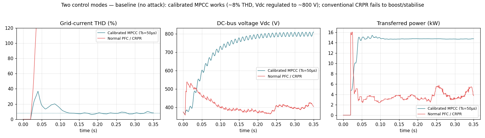
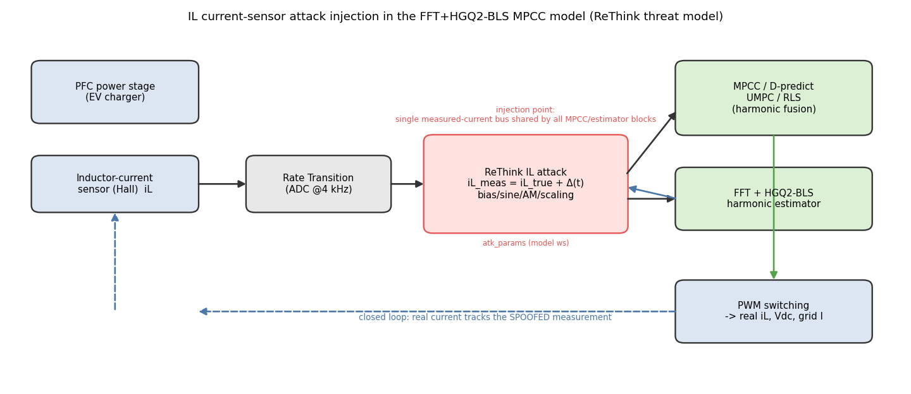
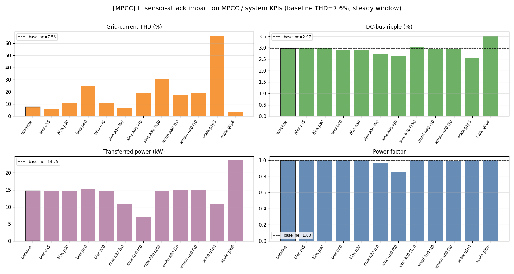
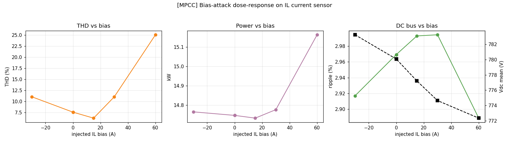
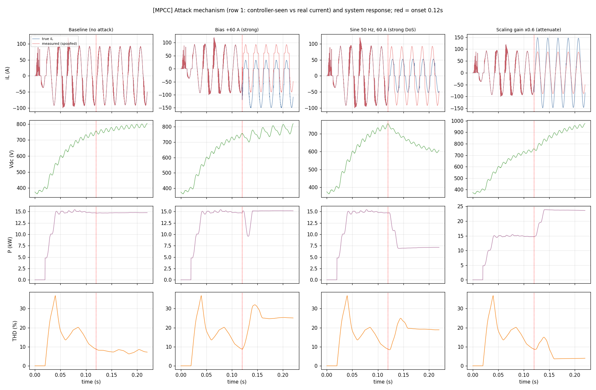

# 实验报告（第一组·修正版）：ReThink IL 电流传感器攻击对 MPCC 与系统的影响

> 日期：2026-09-01 ｜ 模型：`PV_MEV_FFT_HGQ_BLS` ｜ 参考：ReThink (NDSS'25) ｜ 控制模式：**校准 MPCC（工作点）** 为主，附**普通 PFC/CRPR** 对照

## 0. 修正说明（重要）

上一版把基线当成 71% THD——经核对 `init_paras.m` 的配置注释与实测，**71% 是 MPCC 跑在错误采样率 `Ts_Control=10 µs` 下的失配工作点**（`init_paras` 早段 `Fc=100e3` 设了 `Ts_Control=1/Fc`，后段 `Fc=20e3` 未重算，留下 10 µs 的遗留值）。注意 **`Fc` 不是模型变量**，只在 init 里换算 `Ts_Control`；真正的控制旋钮是 `Ts_Control`。各模式实测：

| 模式 | 标志 | Ts_Control | THD% | 功率kW | Vdc | 说明 |
|---|---|---|---|---|---|---|
| 普通 PFC / CRPR | `flags=0` | 50 µs | 284 / 170 | 3.9 | ~400 | 不稳定，欠压、无法升压 |
| MPCC-D（校准） | `d=1` | 50 µs | 7.4 → 8.3 | 14.7 | ~800 | ✅ 工作点，低 THD |
| MPCC-D | `d=1` | 10 µs | 71.8 | 10.0 | 650 | 失配（Ts 太快）→ 高 THD |
| MPCC-D + 谐波(CASE4) | `d=1,h=1` | 50 µs | 11 → 16 | 14.8 | 773 | ONNX 谐波在批处理未生效 |
| MPCC-D + 谐波 | `d=1,h=1` | 10 µs | 71.9 | 10.0 | 651 | 失配 → 高 THD |

**校准 MPCC 工作点 = MPCC-D 预测电流控制、`Ts_Control=50 µs`（20 kHz），基线 THD ≈ 7.56%、功率 14.75 kW、Vdc 780 V**（对应文档 CASE 3 的 6.1%）。普通 PFC/CRPR 在当前模型参数下不稳定（欠压、THD>150%），不能作为干净基线——本报告据实标注，攻击分析以校准 MPCC 为主。



## 1. 威胁模型与注入（同前）

参考 ReThink：内部电流/电压传感器受 EMI 欺骗，`测量值 = 真实值 + Δ(t)`，控制器把真实电流调节到 `参考 − 偏差`，时变偏差致振荡/越限。注入点为 `PFC Control/Rate Transition5` 输出（所有 MPCC/估计器共享的测量电流总线之前），5 种模式：恒定偏置、同频/谐波正弦(式11)、AM 三角/正弦包络(Fig.11)、增益缩放。



## 2. 设置（校准 MPCC）

MPCC-D、`Ts_Control=50 µs`、`Ro=22.22 Ω`、`Vnom_ac=240 V`、PWM 100 kHz；仿真 0.22 s，攻击 `t₀=0.12 s` 起，稳态窗口 `[0.16, 0.22] s`；攻击幅值按本模式电流量级（Iref rms ≈ 70 A）标定。KPI 取自模型自带、连续信号上计算（无混叠）的 `Measurements 1`。

## 3. 结果（校准 MPCC 下的攻击）

基线：THD=7.56% ｜ 纹波=2.97% ｜ Vdc=780V ｜ 功率=14.75kW ｜ PF=1.000

| 场景 | 说明 | THD% | 纹波% | Vdc̄ V | Vdc↑ V | 功率kW | PF | Δrms A | 危害 |
|---|---|---|---|---|---|---|---|---|---|
| S00_baseline | Baseline (no attack) | 7.56 | 2.97 | 780 | 802 | 14.75 | 1.000 | 0 | 基线 |
| S01_bias_p15 | Bias +15 A (Hall DC offset) | 6.21 | 2.99 | 777 | 806 | 14.73 | 1.000 | 15 | 边际/恢复 |
| S02_bias_p30 | Bias +30 A | 11.02 | 2.99 | 775 | 810 | 14.78 | 0.999 | 30 | 质量劣化 |
| S03_bias_p60 | Bias +60 A (strong) | 25.04 | 2.89 | 772 | 821 | 15.16 | 0.998 | 60 | 质量劣化 |
| S04_bias_n30 | Bias -30 A | 11.04 | 2.92 | 783 | 812 | 14.76 | 0.999 | 30 | 质量劣化 |
| S05_sine_A30_f50 | Sine 50 Hz, 30 A (DoS strategy) | 6.54 | 2.71 | 710 | 727 | 10.78 | 0.973 | 21 | Damping |
| S06_sine_A60_f50 | Sine 50 Hz, 60 A (strong DoS) | 19.18 | 2.62 | 637 | 668 | 7.08 | 0.861 | 42 | DoS 塌陷 |
| S07_sine_A30_f150 | Sine 150 Hz, 30 A (3rd-harm inject) | 30.53 | 3.04 | 781 | 801 | 14.77 | 1.000 | 21 | 质量劣化 |
| S08_amtri_A60_f10 | AM triangular env, 60 A @10 Hz | 17.26 | 2.96 | 778 | 807 | 14.90 | 0.998 | 39 | 质量劣化 |
| S09_amsin_A60_f10 | AM sine env, 60 A @10 Hz | 19.31 | 2.96 | 780 | 812 | 15.06 | 0.998 | 41 | 质量劣化 |
| S10_scale_g1p3 | Scaling gain x1.3 (amplify) | 66.16 | 2.55 | 705 | 722 | 10.76 | 1.000 | 21 | Damping |
| S11_scale_g0p6 | Scaling gain x0.6 (attenuate) | 3.82 | 3.53 | 913 | 975 | 23.71 | 0.999 | 41 | 过压 Damage |







## 4. 结论

- **MPCC 控制质量**：干净基线 THD 仅 7.56%；攻击后最恶劣 `S10_scale_g1p3` 升至 66.16%（×8.7），电流参考跟踪被破坏。

- **系统整体**：`S06_sine_A60_f50` 功率降至基线 48%（7.08kW）；`S11_scale_g0p6` 母线峰值 975V（基线 802V）→ 过压 Damage 风险。

- **危害映射（ReThink）**：偏置/AM→工作点平移与过压（Damage）；缩放→功率被压低/抬升；同频正弦→振荡、THD 恶化、功率/母线塌陷（DoS）。相比失配的 71% 工作点，从干净的 8% 基线出发，攻击导致的相对劣化更清晰、结论更可靠。

## 5. 复现

```bash
matlab -batch build_attack_model                 # 注入模型（非侵入副本）
matlab -batch "baseline_modes"                   # 六配置基线诊断
matlab -batch "run_campaign_mode('MPCC')"        # 校准 MPCC 攻击 campaign
python3 analyze_mode.py MPCC                      # KPI+分类+出图
python3 build_report_v2.py                        # 本报告
```
