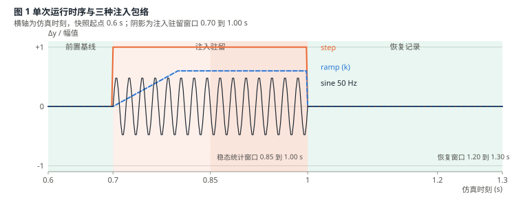
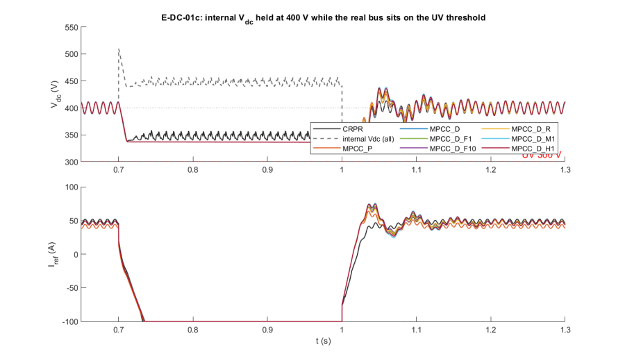
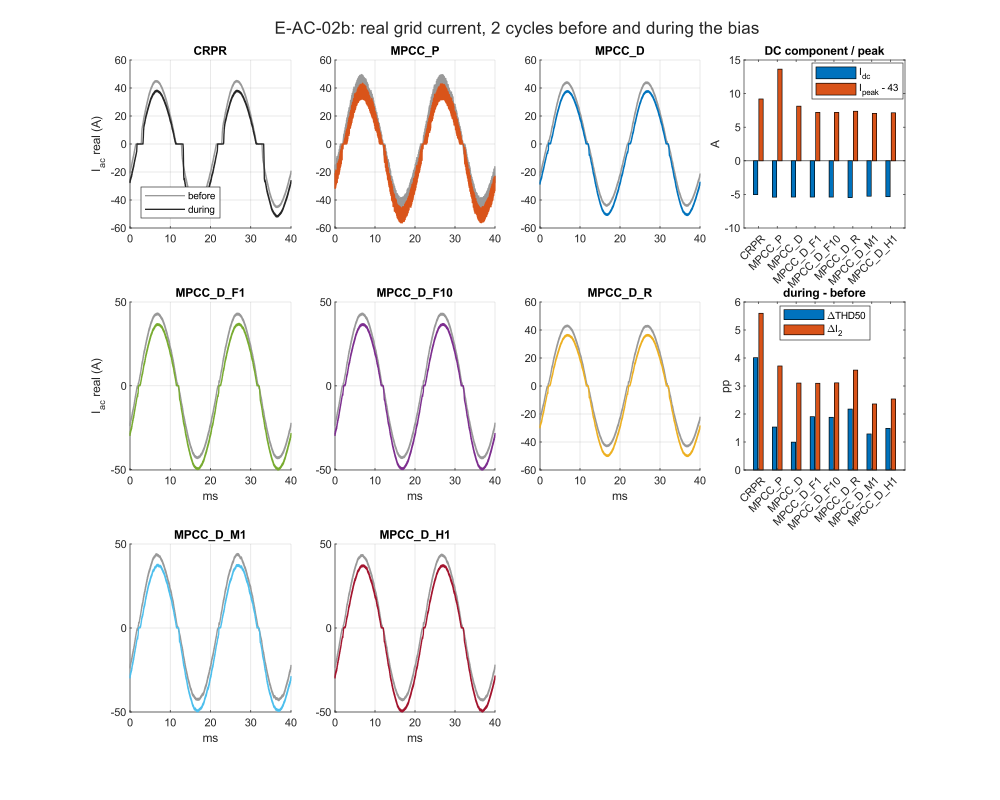
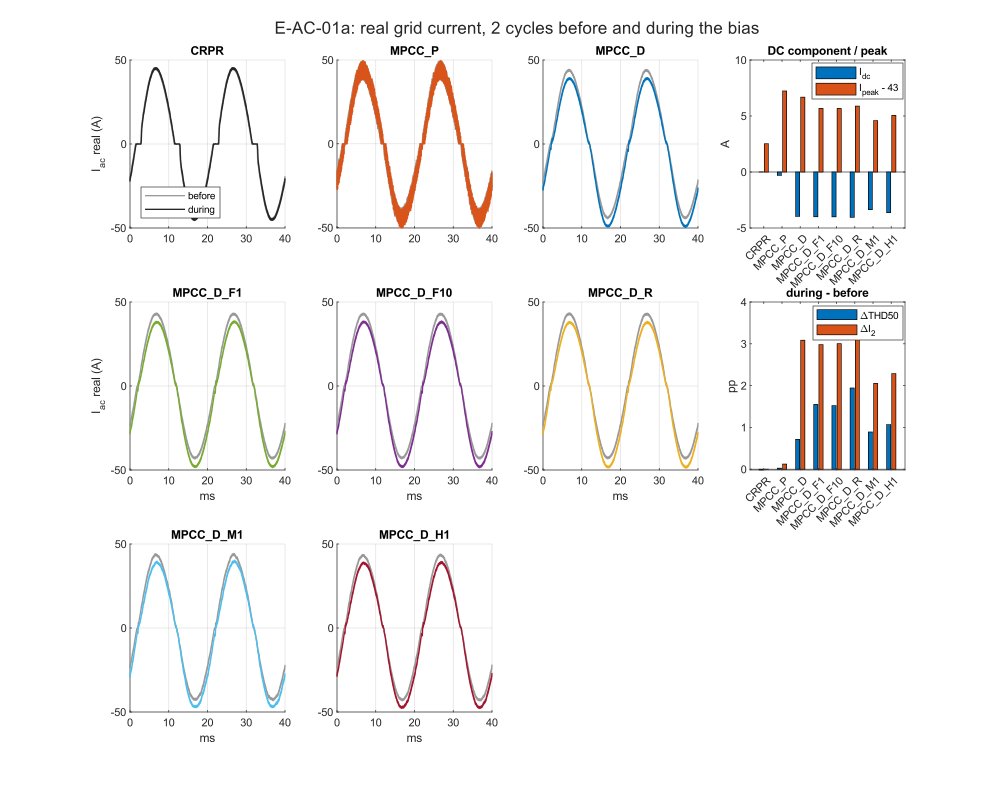
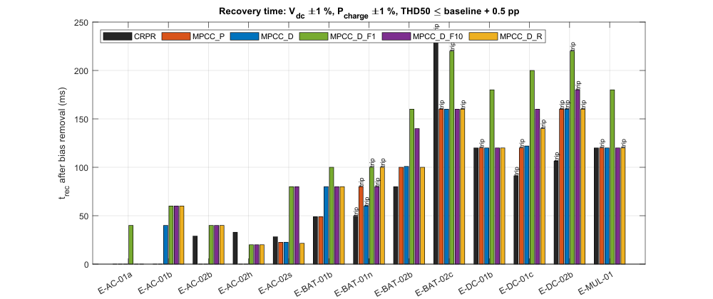
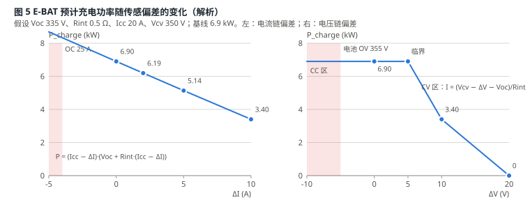
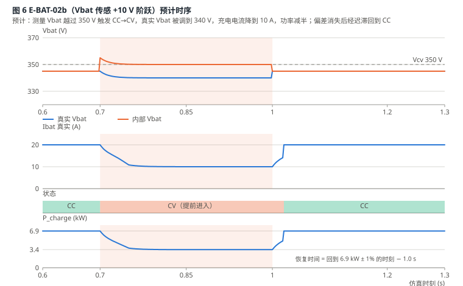
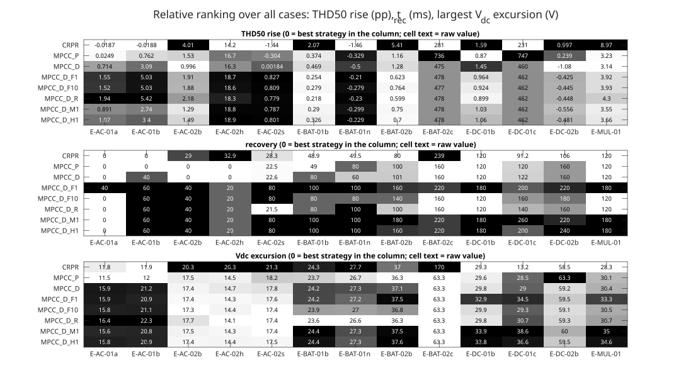
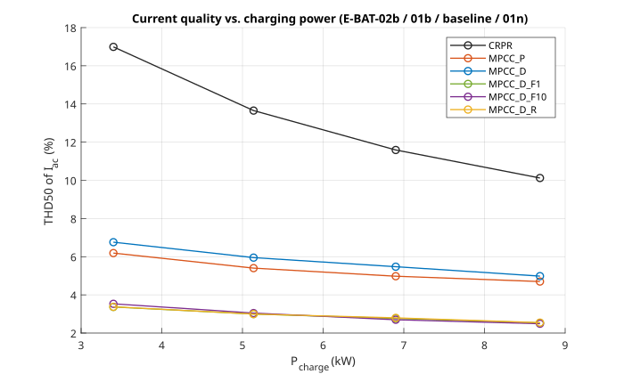

# EV 充电机 PFC 传感链注入测试规划

把《光伏逆变器电磁可靠性测试》中的射频注入项目折算为仿真中的等效测量偏差，在 PV_MEV 模型上对六种 PFC 电流控制策略做统一对比，并定义每项测试应产出的数据与图。

| 项目 | 内容 |
|---|---|
| 被测模型 | `Simulation/PV_MEV/PV_MEV.slx`（EV System 需按第 3.5 节增加电池充电级） |
| 基线提交 | `548e913`（2026-09-02） |
| 被测策略 | CRPR、MPCC_P、MPCC_D、MPCC_D_F1、MPCC_D_F10、MPCC_D_R |
| 工作点 | Vac 240 V / 50 Hz，Vdc 参考 400 V，电池恒流 20 A / 恒压 350 V（约 6.9 kW） |
| 工具 | `build_injection.m`（建库块、改模型）、`tests.csv`（表 6-1）、`run_injection.m`（快照、用例、记分卡）、`make_injection_figs.m`（图 2 到图 8）；基线工具 `init_paras.m`、`run_benchmark.m` |
| 规模 | 13 条用例 × 6 策略 = 78 次注入运行，加 6 次充电级基线；实测单次 0.7 s 仿真平均 932 s（3 进程并行），总计约 7 h（2026-09-02 19:30 到 09-03 02:30） |
| 图 | `docs/figures/fig1` 为示意图；图 2 到图 8 为 2026-09-03 由 `make_injection_figs` 生成的实测版（svg + png） |

值的标注约定：**[实]** 已有基准数据；**[预]** 由外环关系或电路参数解析得出的预期值；**[待]** 只能由仿真给出，表中只写预期方向。

---

## 1 目的与范围

原始测试计划用外部射频场干扰逆变器的电压和 Hall 电流传感链，观察控制环、保护逻辑、母线和并网侧的响应。对功率级和控制器而言，射频作用的最终形式只有一种：控制器读到的内部量 y\* 偏离真实量 y 一个等效偏差 Δy。仿真无法复现天线、频率和距离，但可以精确复现 Δy，并把同一组 Δy 施加到不同的电流控制策略上，比较它们的敏感程度和恢复能力。

本规划只覆盖 EV 充电机，五条传感链：

- PFC 级：母线电压 Vdc、电网电压 Vac、电网电流 Iac（对应原文 T-DC-01、T-DC-02、T-AC-01、T-AC-02、T-MUL-01）。
- 电池充电级：电池电压 Vbat、电池电流 Ibat。电池电流测量出现正向偏差时，充电控制器会降低实际充电电流；电池电压测量出现正向偏差时，控制器可能提前从恒流切换到恒压，从而降低充电功率。这一组测试评估充电机面对电磁环境变化时的功率调节能力，重点记录实际充电功率、CC/CV 状态、占空比、母线电压、功率因数以及偏差消失后的恢复时间。

PV 侧（MPPT）测试不在本规划范围内。

**不在范围内。** 传感器 PCB、运放输入级和屏蔽结构的差异（原文 P2、P3 阶段）不能由仿真区分；这些阶段的输出（fc+、fc- 和 Δy 对功率、距离的映射）在这里退化为一个已知的 Δy 幅值序列。

**用例取舍原则。** 每条传感链只保留两类用例：一个落在线性区、稳态值可以解析预计的档位（用于验证注入链路，并给出各策略的过渡过程差异），和一个触及保护阈值或状态边界的档位（用于比较各策略在边界处的行为）。同一通道的中间档位、斜坡与脉冲包络、以及稳态对六种策略必然相同且能解析得出的用例都不再单独运行；需要时按第 6 节的保留字段补回 `tests.csv`。

## 2 射频测试到仿真变量的折算

表 2-1 原文阶段与项目在仿真中的对应

| 原文阶段 / 项目 | 物理含义 | 仿真中的处理 |
|---|---|---|
| P0 台架确认、P1 基线采集 | 射频关闭下的稳态数据 | 电阻负载下已完成（表 4-1）；增加充电级后需重跑 B0' |
| P2 频率响应图谱（fc+、fc-） | 找到能使内部量增大或减小的载波 | 不需要。正偏差和负偏差直接用 Δy 的符号表示 |
| P3 幅值与空间标定 Δy = F(fc, P, d, θ, p) | 射频功率、距离到偏差幅值的映射 | 不需要。Δy 幅值直接作为自变量分档（第 5 节） |
| 5.2 单频恒定偏置 | 恒定 Δy 持续数秒 | 阶跃注入，驻留 0.3 s；本轮主体 |
| 5.3 幅度调制包络 | Δy 随低频包络变化 | 发生器保留 tri / pulse 形状，本轮不运行 |
| 5.4 双载波双向调节 | 跨越零点的正弦偏差 | 有符号的 50 Hz 正弦 Δy，相位 90°，只在 Iac 通道运行 |
| 5.5 斜坡渐进偏置 | Δy = k·t + s0 | 斜坡限幅注入，只用于母线负偏（T-DC-02） |
| 5.6 多频叠加 | 多个通道同时受扰 | 一条双通道用例（E-MUL-01） |
| P4 闭环项目、P5 重复与恢复 | 整机闭环响应、10 次重复 | 本规划主体。仿真是确定性的，重复次数取 1 |

等效偏差的作用关系与原文式 (10)、(11) 一致。PFC 级对所有策略成立，因为电压外环相同；充电级对所有策略成立，因为充电控制器相同：

```
PFC 级    Vdc*  = Vdc + Va               内部量 = 真实量 + 偏差
          Vdc   = Vdc,ref − Va          外环把内部量拉到参考值，真实母线反向偏移
充电级    Ibat  = Icc − ΔI               恒流段：真实电流被压低
          Vbat  = Vcv − ΔV               恒压段：真实电压被压低，I = (Vbat − Voc) / Rint
          P_charge = Ibat · Vbat
```

电流链的偏差不经过外环，而是直接进入 PFC 电流内环。三种内环对 Iac 和 Vac 的使用方式不同，这是各策略表现出差异的根源（表 4-2）。充电级的偏差先改变充电功率，再作为负载功率阶跃作用到 PFC，各策略的差异体现在母线电压过渡过程和部分负载下的电流质量。

## 3 仿真测试台

### 3.1 注入点与真实量、内部量的分离

模型现状已经满足原文 3.3 节"真实量与内部量同时记录"的要求：`EV System/Measurements 1` 直接取电路量，相当于独立探头；`PFC Control` 的三个测量输入相当于控制器内部量。注入块插在两者之间。充电级的两个注入点在新增子系统内按同样方式布置。

表 3-1 注入点

| 通道 | 模型位置（EV System 内） | 受影响的控制环节 | 真实量来源 |
|---|---|---|---|
| Vdc | From16 [Vdc_PFC] → PFC Control 输入 2 | 电压外环（Speed Regulator2）；MPCC_D 前馈占空比 D_ff = 1 − \|Vin\| / Vo 和增益 L / (Vo·Ts) | Measurements 1 输入 Vdc |
| Vac | From18 [Vac] → PFC Control 输入 3 | PLL 相位 θ；\|sin θ\| 参考形状；MPCC_P 半周极性判定 sign(Vin)；MPCC_D 前馈 | Measurements 1 输入 Vac |
| Iac | From19 [Iac] → PFC Control 输入 4 | CRPR 的 \|Iac\|；MPCC 逐拍预测的 i_L；FFT / RLS 谐波估计器输入 | Measurements 1 输入 Iac |
| Vbat | Charger Stage / 电压测量 → CC/CV 控制器 | CC→CV 切换判定；CV 环 | 电池端口电压 |
| Ibat | Charger Stage / 电流测量 → CC/CV 控制器 | CC 环；过流判定 | 电池支路电流 |

### 3.2 干扰发生器

做成 MyLibrary 里的掩码块 `Disturbance Injector`（掩码参数 `ch_id`、`Ts_inj`、`Ts_out`），内部按 `Ts_inj` 计算 Δy(t) 后经速率转换与被扰信号相加。参数由 `run_injection.m` 从 `tests.csv` 一行装入基础工作区结构 `INJ`，`init_paras.m` 展开为 `inj_*` 变量；无 `INJ` 时幅值为 0。通道与形状用整数编码：通道 1 Vdc、2 Vac、3 Iac、4 Vbat、5 Ibat；形状 1 step、2 ramp、3 sine、4 tri、5 pulse、6 hall。`INJ` 的 channel / shape / amp 为 1×2 向量，第二项用于 E-MUL-01 的同时注入。

表 3-2 干扰发生器参数

| 参数 | 含义 | 取值 |
|---|---|---|
| `channel` | 注入通道 | Vdc / Vac / Iac / Vbat / Ibat |
| `shape` | 包络形状（对应原文 5.2 到 5.6） | step / ramp / sine / hall；tri / pulse 保留，本轮不用 |
| `amp` | 偏差幅值，带符号 | V 或 A，见第 5 节档位 |
| `k` | 斜坡速率 | V/s，ramp 时有效 |
| `f`, `phase` | 正弦偏差频率与相位（相对 Vac 过零） | 50 Hz；90° |
| `period`, `duty` | 开关或三角包络周期与占空比 | 保留字段 |
| `t_on`, `dwell` | 注入起始时刻与驻留时间 | 0.70 s 起、驻留 0.30 s |
| `K_hall` | Hall 传感增益；hall 形状输出 K_hall·(0.2 + 0.5·sin 2πft)，不用 `amp` | 默认 20 A/V（假设值，需按实际传感器改） |

### 3.3 保护监视块

原文要求母线高值项目使用独立于控制器读数的硬件断电阈值。仿真里加一个只看真实量的监视块 `Protection Monitor`（MyLibrary），以 `Ts_chg` = 10 µs 判定，输出 [触发代码, 触发时刻]，代码 1 UV、2 OV、3 OC、4 BOV、5 BOC；阈值向量 `prot_thr` 在 `init_paras.m`，最后一项为使能时刻 0.55 s，避免 0 s 上电冲击电流（约 270 A 峰值）占用"首次触发"记录。本轮只记录，不封锁 PWM：

| 项目 | 条件 |
|---|---|
| 母线欠压 UV | 真实 Vdc < 300 V，持续 2 ms |
| 母线过压 OV | 真实 Vdc > 450 V，持续 2 ms |
| 电网过流 OC | 真实 \|Iac\| > 65 A（1.5 倍额定峰值 43 A） |
| 电池过压 BOV / 过流 BOC | 真实 Vbat > 355 V 持续 2 ms；真实 Ibat > 25 A。本轮用例不会主动触及，只作监视 |
| 动作 | 记录触发时刻与原因；默认只记录不封锁，便于观察完整轨迹；可选封锁 PWM |

### 3.4 稳态快照

每条用例从 0.6 s 的模型工作点（`ModelOperatingPoint`）起跑，省去暖机，单次仿真时长 0.7 s。六种策略各保存一份 CC 段快照（Voc 335 V，`results/emi/snapshots/<策略>.mat`），共 6 份，由 `run_injection('baseline')` 生成。CV 段快照本轮不需要。新增块的全部状态放在 Unit Delay 中，不用 MATLAB Function 的 persistent 变量，保证快照可完整恢复；`run_injection('smoke')` 用"从快照续跑"与"从 0 直跑"在 0.6 到 0.72 s 的差值核对这一点。

### 3.5 模型扩展：电池充电级

原 EV System 的负载是电阻 Ro（Ro1 常接，Ro2 在 0.4 s 由理想开关投入），没有电池和 CC/CV 控制。`build_injection.m` 把 Ro1 改为 100 kΩ 泄放电阻 `Rbleed`，在其两端并联 MyLibrary 的 `Charger Stage`；Ro2 改名 `Rpre`（44.4 Ω，3.6 kW）作为上电预载，理想开关在 `t_pre_off` = 0.30 s 断开。预载不能省：CRPR 的电压外环在空载母线上积分饱和到 −100 A 后仍持续升压，充电级投入前母线已超过 900 V（MPCC_D 系列不受影响，占空比归零）。充电级 0.20 s 起以 100 A/s 斜坡到 20 A（0.40 s 到达），预载在斜坡中点断开，母线负载从 3.6 kW 过渡到 6.9 kW 期间始终不为零。参数为假设值，按实际充电机替换。

充电级用平均模型而不是开关模型：降压变换器按 10 µs 步长更新电感电流 di/dt = (D·Vdc − Vbat)/L，母线侧通过受控电流源取电 D·Ibat（无损平均），不引入 100 kHz 开关纹波，避免把 50 ns 功率级仿真再放慢一倍。占空比、CC/CV 状态、真实与内部 Vbat / Ibat 都是显式信号。受控电流源的极性由 `build_injection('probe')` 和基线运行确认（`I_SIGN = +1`；取 −1 时母线被推到 1430 V、Pdc 为负）。

表 3-3 充电级参数

| 项目 | 取值 | 说明 |
|---|---|---|
| 拓扑 | 降压 DC-DC 平均模型，400 V 母线 → 电池 | L 1 mH，更新周期 `Ts_chg` 10 µs；输出电容省略，Vbat = Voc + Rint·Ibat |
| 控制器 | 内环电流 PI（Kp 0.016，Ki 10）加占空比前馈 Vbat/Vdc；外环 CV 电压 PI（Kp 1.5，Ki 1500） | 内环带宽约 1 kHz；CC 段外环积分器预置为电流参考，切换无跳变 |
| 电池 | 开路电压 Voc 335 V，内阻 Rint 0.5 Ω | 电压源加电阻；也可用 Simscape Battery 块 |
| 恒流 CC | Icc = 20 A，PI 环，参考斜率 100 A/s | 基线：Vbat = 335 + 0.5 × 20 = 345 V，P = 6.9 kW |
| 恒压 CV | Vcv = 350 V，PI 环 | I = (Vcv − Voc) / Rint |
| 状态切换 | Vbat_meas ≥ Vcv → CV；Vbat_meas ≤ Vcv − 5 V 持续 20 ms → 回 CC | 回 CC 的迟滞只为观察偏差消失后的恢复过程设置，实际充电机通常单向 |
| 使能 | 0.20 s 起以 100 A/s 斜坡到 20 A，0.40 s 到达；预载 `Rpre` 0.30 s 断开 | 替代原来 0.4 s 的电阻负载阶跃；快照时刻 0.6 s 距最后一次负载变化 200 ms |

增加充电级后 PFC 的负载从电阻变为恒功率型，六种策略的无扰基线必须重跑（批次 B0'），表 4-1 中的电阻负载基线仅作参考。

## 4 被测策略与基线

表 4-1 六种策略的无扰基线（电阻负载 22.22 Ω，[实]，2026-09-02，1 s 仿真，最后 100 ms，`results/benchmark_results.csv`）

| 策略 | 电流内环 | Fc | Vdc (V) | Pdc (kW) | Pac (kW) | 效率 | PF | THD50 | 全频带 THD | 纹波 | 阶跃后最低 Vdc | 调节时间 |
|---|---|---|---|---|---|---|---|---|---|---|---|---|
| CRPR | PR 控制器 + 100 kHz PWM | 100 kHz | 400.0 | 7.203 | 7.330 | 98.27% | 0.9995 | 11.20% | 11.28% | 5.93% | 383.6 V | 59 ms |
| MPCC_P | 逐拍预测直接门控，无 PWM | 100 kHz | 400.0 | 7.203 | 7.329 | 98.28% | 0.9996 | 4.86% | 10.49% | 5.67% | 384.0 V | 60 ms |
| MPCC_D | 占空比预测 + 100 kHz PWM | 20 kHz | 400.0 | 7.203 | 7.329 | 98.28% | 1.0000 | 5.22% | 5.37% | 5.72% | 383.5 V | 61 ms |
| MPCC_D_F1 | MPCC_D + 1 周期 FFT 谐波补偿 | 20 kHz | 400.0 | 7.203 | 7.329 | 98.29% | 1.0000 | 2.65% | 2.96% | 5.58% | 382.9 V | 61 ms |
| MPCC_D_F10 | MPCC_D + 10 周期 FFT 谐波补偿 | 20 kHz | 400.0 | 7.203 | 7.329 | 98.29% | 1.0000 | 2.65% | 2.95% | 5.59% | 383.5 V | 61 ms |
| MPCC_D_R | MPCC_D + RLS 谐波补偿 | 20 kHz | 400.0 | 7.203 | 7.329 | 98.28% | 1.0000 | 2.66% | 2.97% | 5.59% | 384.0 V | 58 ms |

表 4-3 六种策略的充电级负载基线（B0'，[实]，2026-09-02，0.6 s 快照前最后 100 ms，`results/emi/baseline_<策略>.csv`）

| 策略 | Vdc (V) | Pdc (kW) | P_charge (kW) | Ibat (A) | PF | THD50 | 全频带 THD | 2 次谐波 | D_dcdc | 触发 |
|---|---|---|---|---|---|---|---|---|---|---|
| CRPR | 399.9 | 6.903 | 6.900 | 20.00 | 0.9995 | 11.59% | 11.7% | 0.04% | 0.841 | — |
| MPCC_P | 399.9 | 6.903 | 6.900 | 20.00 | 0.9996 | 4.98% | 11.0% | 0.04% | 0.863 | — |
| MPCC_D | 399.9 | 6.903 | 6.900 | 20.00 | 1.0000 | 5.48% | 5.6% | 0.07% | 0.842 | — |
| MPCC_D_F1 | 399.8 | 6.903 | 6.900 | 20.00 | 1.0000 | 2.76% | 3.0% | 0.08% | 0.842 | — |
| MPCC_D_F10 | 399.9 | 6.903 | 6.900 | 20.00 | 1.0000 | 2.70% | 2.9% | 0.05% | 0.842 | — |
| MPCC_D_R | 399.9 | 6.903 | 6.900 | 20.00 | 1.0000 | 2.80% | 3.0% | 0.07% | 0.842 | — |

恒功率负载下的 THD50 与电阻负载基线（表 4-1）一致到 0.4 pp 以内，排序不变；母线 100 Hz 纹波峰峰约 20 V（±10 V），是后面所有过冲、欠冲数值的底噪。

表 4-2 各策略对传感链的依赖，即预期敏感点

| 策略 | Vdc 偏差 | Vac 偏差 | Iac 偏差 | Vbat / Ibat 偏差（经充电功率变化间接作用） |
|---|---|---|---|---|
| CRPR | 仅经外环，真实 Vdc = 400 − Va | 仅经 PLL；过零偏移改变 \|sin θ\| 参考形状 | \|Iac + ΔI\| 与 Iref 比较，两个半周都被推偏 −ΔI；PR 带宽有限，偏差进入 100 Hz 谐振项 | 部分负载下 PR 稳态幅值误差不变，THD 上升最多 |
| MPCC_P | 经外环；预测式中的 V_o 项 | sign(Vin) 决定半周极性，直流偏差把切换点移离真实过零，预计每半周一次电流尖峰 | i_L 被逐拍精确跟踪到 Iref，真实电流带 −ΔI 直流分量；无 PWM，尖峰无载波平滑 | 部分负载下逐拍预测步长相对变大，全频带 THD 上升 |
| MPCC_D | 经外环；D_ff 和 plant_gain 都含 Vo | D_ff = 1 − \|Vin\| / Vo 直接受扰，过零附近占空比误差 ΔV / Vo | 同 MPCC_P 的直流分量；追踪增益 0.35 使响应比 MPCC_P 缓 | 母线过渡过程与 CRPR 接近 |
| MPCC_D_F1 / F10 / R | 同 MPCC_D | 同 MPCC_D | 污染后的 Iac 进入谐波估计器，偏差被当作谐波补偿回参考；窗口决定恢复时间：F1 约 20 ms，F10 约 200 ms，RLS 约 3 × 18 ms | 功率阶跃时估计器需要重新收敛，THD 暂时上升，F10 最慢 |

## 5 自变量与档位

幅值按原文第 7 节公开范围等比例缩放到本模型：原文母线 385 V、本模型 400 V；原文电流偏差 −30 到 +320 A 对应大功率机型，本模型电网额定峰值 43 A、电池恒流 20 A。每个通道只取"线性区一档 + 边界一档"，见第 1 节取舍原则。

表 5-1 偏差档位

| 通道 | 原文范围 | 本模型档位 | 物理含义 |
|---|---|---|---|
| Vdc 正偏（T-DC-01） | +20 V 起，参考点 +100 V | +50 V（线性）、+100 V（边界） | 真实母线被压低到 350、300 V；300 V 触及 UV 阈值 |
| Vdc 负偏（T-DC-02） | −50、−100、−200 V | −100 V，斜坡 1000 V/s | 真实母线被抬高到 500 V，途中 450 V 触及 OV；0.1 s 到达 |
| Vac 直流偏差（T-AC-01） | 报警点 200 V 与 240 V | +17 V（线性）、+34 V（边界） | 过零偏移 0.16、0.32 ms，相当于 100 kHz 下 16、32 个控制拍，20 kHz 下 3、6 拍 |
| Iac 直流偏差（T-AC-02） | 数安培起 | +5 A | 真实电流预计出现 −5 A 直流分量；边界档由 Hall 模型和多通道用例覆盖 |
| Iac 50 Hz 正弦偏差 | 双载波正弦 | 10 A，相位 90° | 与电流参考正交，预计 PF 降到 0.974 |
| Hall 模型 | 0.2 V 直流 + 0.5 V 振荡 | K_hall = 20 A/V → 4 A 直流 + 10 A 振荡，100 Hz | 原文公开的 Hall 芯片受扰现象；2 次谐波直接进入估计器 |
| Ibat 偏差 | 电流链 | +5 A | 真实充电电流 15 A，功率保持率 74% |
| Vbat 偏差 | 电压链 | +10 V（提前进入 CV）、+20 V（充电停止） | +10 V 功率减半；+20 V 真实目标 330 V 低于 Voc，电流为零，PFC 空载 |
| 多通道（T-MUL-01） | 逐个叠加 | Vdc +50 V 与 Iac +5 A | 观察外环与内环偏差的耦合，与两条单通道用例比较 |

## 6 测试矩阵

每条用例对六种策略各跑一次。编号前缀 E 表示 EV 充电机侧，编号沿用完整矩阵的字母，便于日后补回中间档位。P1 为首轮必跑（7 条），P2 为补充（6 条）。

表 6-1 用例定义（`tests.csv` 的内容）

| 编号 | 原文项目 | 通道 | 形状 | 幅值 | 其他参数 | 优先级 | 这条用例要回答的问题 |
|---|---|---|---|---|---|---|---|
| E-DC-01b | T-DC-01 | Vdc | step | +50 V | t_on 0.70 s，驻留 0.30 s | P1 | 注入链路是否正确（真实 Vdc 应为 350 V）；六策略的欠冲与调节时间差异 |
| E-DC-01c | T-DC-01 | Vdc | step | +100 V | 同上 | P1 | 真实母线落在 UV 阈值上时，哪种策略的欠冲会触发保护 |
| E-DC-02b | T-DC-02 | Vdc | ramp | 到 −100 V | k = 1000 V/s | P1 | 真实母线上升速率是否受外环限制；OV 触发时刻；退饱和恢复 |
| E-AC-01a | T-AC-01 | Vac | step | +17 V | 驻留 0.30 s | P1 | 过零偏移对三种内环的影响：MPCC_P 极性错误尖峰、MPCC_D 前馈误差、CRPR 参考畸变 |
| E-AC-01b | T-AC-01 | Vac | step | +34 V | 同上 | P2 | 尖峰是否随偏移线性增长；MPCC_P 是否触及 OC |
| E-AC-02b | T-AC-02 | Iac | step | +5 A | 驻留 0.30 s | P1 | 真实电流直流分量与偶次谐波；谐波估计器被直流污染的程度与恢复时间 |
| E-AC-02s | T-AC-02 | Iac | sine | 10 A | 50 Hz，相位 90° | P2 | 正交偏差是否只表现为无功（PF 0.974）；估计器基波幅值是否被抬高 |
| E-AC-02h | 2.2 Hall 模型 | Iac | hall | 4 A + 10 A | 振荡 100 Hz | P2 | 原文 Hall 现象下的 2 次谐波与 THD；FFT 与 RLS 估计器对 100 Hz 泄漏的反应 |
| E-MUL-01 | T-MUL-01 | Vdc + Iac | step | +50 V，+5 A | 同时注入 | P2 | 外环与内环偏差是否可叠加：THD50 与 E-DC-01b、E-AC-02b 之和的差 |
| E-BAT-01b | 电池电流链 | Ibat | step | +5 A | 驻留 0.30 s，CC 段快照 | P1 | 充电功率保持率（预计 74%）；功率下降与恢复时 PFC 母线过冲、欠冲 |
| E-BAT-02b | 电池电压链 | Vbat | step | +10 V | 同上 | P1 | 提前进入 CV 使功率减半；切换时刻；部分负载下六策略的电流质量 |
| E-BAT-02c | 电池电压链 | Vbat | step | +20 V | 同上 | P2 | 充电停止后 PFC 空载：母线是否漂高、哪种策略在近零电流下失去电流形状 |
| E-BAT-01n | 电池电流链 | Ibat | step | −5 A | 同上 | P2 | 负偏差使真实电流升到 25 A 触及 BOC；保护监视块在充电级的动作 |

补回字段：完整矩阵中删去的用例（E-DC-01a +20 V、E-DC-01r 斜坡、E-DC-02a/c、E-AC-02a/c/d、Hall 1 kHz、E-BAT-01a/c、E-BAT-02a/n、E-BAT-03 脉冲）与本轮用例的发生器参数兼容，只需在 `tests.csv` 追加行。

## 7 单次运行时序与停止条件



表 7-1 时序，对应原文 4.3

| 仿真时刻 | 动作 | 对应原文步骤 |
|---|---|---|
| 0.600 s | 从策略对应的稳态快照起跑，载入 tests.csv 一行与保护阈值 | 载入测试编号与限值 |
| 0.600 到 0.700 s | 前置基线 5 个工频周期，核对真实量与内部量在允许区间 | 射频关闭采集 10 s 前置基线 |
| 0.700 s | 注入开始（step 立即到幅值；ramp 按 k 上升） | 施加测试信号 |
| 0.700 到 1.000 s | 驻留 15 个周期；保护监视块持续判定 | 保持到驻留时间或停止条件 |
| 1.000 s | 注入关闭 | 关闭射频 |
| 1.000 到 1.300 s | 恢复记录 15 个周期 | 继续采集至少 10 s |
| 1.300 s | 结束，写出 `results/emi/<编号>_<策略>.csv` 与摘要行 | 保存原始数据与摘要 |

驻留和恢复各 0.3 s 不再压缩：MPCC_D_F10 的估计器窗口 200 ms，短于 0.3 s 的窗口会把"注入中稳态"统计到估计器尚未收敛的区间，使 F10 的 THD 失去可比性。

表 7-2 停止条件，对应原文 4.4

| 类别 | 条件（只看真实量） | 动作 |
|---|---|---|
| 母线电压 | Vdc < 300 V 或 > 450 V 持续 2 ms | 记录触发时刻与类别；可选封锁 PWM 并让母线自然放电 |
| 电网电流 | \|Iac\| > 65 A | 同上 |
| 电池 | Vbat > 355 V 持续 2 ms，或 Ibat > 25 A | 记录；可选封锁 DC-DC |
| 控制状态 | D 饱和在 0 或 1 超过 1 个工频周期；Iref 到达 ±100 A 限幅；CC/CV 状态变化 | 记录，不停止 |
| 测量链 | 仿真求解器报错或 NaN | 该次作废，摘要行标 FAILED |

## 8 评价指标

按原文 9.2 分三个窗口统计：注入前（0.60 到 0.70 s）、注入中稳态（0.85 到 1.00 s，最后 7.5 个周期）、恢复后（1.20 到 1.30 s）。

```
测量误差       e_meas   = y_internal − y_real                    （= 注入的 Δy，用于自检）
母线偏差       ΔVdc     = mean(Vdc_real) − 400 V                  注入中窗口
母线过冲/欠冲  max(Vdc_real) − 较高平台，min(Vdc_real) − 较低平台   注入开始后 100 ms 内（平台 = 注入前、注入中均值）；注入结束后 100 ms 内（平台 = 注入中均值、400 V）；原始信号，含 ±10 V 的 100 Hz 纹波
电流跟踪误差   e_I,rms  = rms(Iref·|sin θ| − |Iac_real|)          注入中窗口
直流分量       I_dc     = mean(Iac_real)                          注入中窗口，一个整周期数
THD50 / 全频带 THD       Iac_real 以 1 MHz 采样，2 到 50 次 / 到 500 kHz
2 次谐波       I_2      = Iac_real 100 Hz 分量幅值 / 基波幅值      注入中窗口
功率因数       PF       = P / S                                   Measurements 1
充电功率       P_charge = mean(Vbat_real · Ibat_real)             注入中窗口；与基线之比为功率保持率
CC/CV 状态     state(t)，t_switch = 首次状态变化时刻 − 0.700 s
DC-DC 占空比   D_dcdc 均值与范围                                  注入中窗口
保护触发       t_trip   = 首次越限时刻 − 0.700 s                  无触发记 —
调节时间       t_settle = 20 ms 滑动均值的 Vdc_real 进入注入中均值 ± 1%（4 V）之后的时刻 − 0.700 s
恢复时间       t_rec    = 20 ms 滑动均值的 Vdc_real 回到 400 V ± 1%、P_charge 回到基线 ± 1% 且逐周期 THD50 回到基线 + 0.5 个百分点之后的时刻 − 1.000 s；三项分别记 t_rec_Vdc / t_rec_P / t_rec_THD，取最大
电流峰值       max |Iac_real|                                     整个注入中窗口
```

## 9 产出数据与图：取什么数据、说明什么

每张表和图只回答一个问题。数据一律取自 `results/emi/scorecard.csv`（每次运行一行）或单次运行的时序文件，列名与第 8 节指标一致，窗口固定，避免事后挑选。解析能得出的预计值只保留在链路验证表（表 9-2）里，其余用"预期形态"描述，由仿真填充。

表 9-1 产出清单

| 编号 | 形式 | 数据来源 | 回答的问题 | 预期形态 / 判据 |
|---|---|---|---|---|
| 表 9-2 | 链路验证 | P1 中三条用例的 CRPR 首次运行，注入中窗口稳态值 | 注入块、快照、充电级是否正确 | 实测与解析值偏差 ≤ 5%，否则不进入策略比较 |
| 表 9-3 | 总记分卡 | 13 用例 × 6 策略，每行摘要列 | 所有图的唯一数据源 | 78 行，status 全部 OK |
| 表 9-4 | PFC 级敏感度 | 记分卡中 E-DC、E-AC、E-MUL 行，每通道取一个代表指标 | 每种策略对哪条传感链最敏感 | 排序与表 4-2 的机理预期一致 |
| 表 9-5 | 充电级响应 | 记分卡中 E-BAT 行 | 充电级偏差转化为负载阶跃后，PFC 侧差异在哪里 | 功率保持率六策略相同；母线过渡与部分负载 THD 不同 |
| 图 2 | 时序叠加 | E-DC-01c 的 Vdc_real、Vdc_int、Iref | 控制器"看到正常"而真实母线落到阈值 | 内部 Vdc 六策略重合于 400 V；真实 Vdc 六条曲线分开于欠冲处 |
| 图 3 | 波形 + 谱线 | E-AC-02b、E-AC-01a 的 Iac_real 与 I_dc、I_2、THD50 | 电流链偏差在三种内环中的表现形式 | 直流偏移六策略相同；过零尖峰只在 MPCC_P 明显 |
| 图 4 | 分组条图 | 记分卡 t_rec 列，全部用例 | 偏差消失后谁恢复得快，估计器窗口的代价 | F1 < R < F10；无估计器策略约 60 ms |
| 图 5 | 曲线 + 散点 | 表 9-2 解析曲线，E-BAT 三条用例实测点 | 偏差幅值到功率损失的映射，CC / CV / 停充三个区间 | 六策略的点重合在解析曲线上 |
| 图 6 | 时序叠加 | E-BAT-02b 的 Vbat、Ibat、state、P_charge，Vdc_real 六策略 | 电压链偏差如何变成 PFC 的负载阶跃 | 状态切换 < 1 ms；Vdc 过冲各策略不同 |
| 图 7 | 热图 | 记分卡归一化后的 THD50 上升、t_rec、Vdc 偏移 | 一眼看出六策略在全部用例上的相对排名 | 无预计版，实测后生成 |
| 图 8 | 折线 | B0'、E-BAT-01b、E-BAT-02b、E-BAT-02c 的 THD50 对 P_charge | 部分负载与空载下电流质量的退化 | 无预计版；CRPR 与 MPCC_P 在低功率处上翘 |

### 9.1 链路验证表（表 9-2）

数据：P1 批次先跑 E-DC-01b、E-AC-02b、E-BAT-01b 各一次 CRPR，取注入中窗口稳态值，与解析值并列。这三次运行同时计入 P1，不重复。

含义：三条传感链各验证一个可以解析预计的量。通过后才能把后续差异归因于控制策略，而不是注入块或快照。

| 用例 | 校核量 | 解析值 | 实测（CRPR，2026-09-02）| 判据 | 结论 |
|---|---|---|---|---|---|
| E-DC-01b | 真实 Vdc 稳态 | 350 V（400 − 50）[预] | 350.0 V [实] | ±5 V | 通过 |
| E-DC-01b | 内部 Vdc 稳态 | 400 V [预] | 400.0 V [实] | ±2 V | 通过 |
| E-DC-01b | Iac 峰值 | 49 A（假设充电级维持 6.9 kW）[预] | 28.2 A，充电功率 4.33 kW [实] | ±5% | 不通过，原因在充电级而非注入链：母线 350 V 时降压级只剩 5 V 余量，在纹波谷点脱出调节（见 9.5 节） |
| E-AC-02b | I_dc | −5 A [预] | −5.03 A [实] | ±0.25 A | 通过 |
| E-AC-02b | 内部 Iac 均值 | 0 A [预] | −0.03 A [实] | ±0.25 A | 通过 |
| E-BAT-01b | Ibat 真实 / Vbat 真实 | 15 A / 342.5 V [预] | 15.0 A / 342.5 V [实] | ±5% | 通过 |
| E-BAT-01b | P_charge、功率保持率 | 5.14 kW、74% [预] | 5.14 kW、74.5% [实] | ±5% | 通过 |
| 任一 | e_meas | 等于注入的 Δy [预] | Vdc +50.0、Iac +5.00、Ibat +5.00 [实] | 自检，逐点相等 | 通过 |

三条链路的注入量都精确到位；唯一偏离预计的是母线偏差用例里的充电功率，属于被测对象的真实行为（充电级余量不足），保留为结果。快照连续性检查（`run_injection('smoke')`）：Vdc、Iac、充电级信号在 0.6 到 0.72 s 的续跑与直跑差值为 0，Iref 差 0.02 A（采样对齐）。

### 9.2 总记分卡（表 9-3，`results/emi/scorecard.csv`）

数据：每次运行一行，78 行。列为标识（test_id、variant、commit、snapshot）、注入参数、和第 8 节全部指标的三窗口值。

含义：不直接阅读，而是所有图和表 9-4、9-5 的数据源。保留三个窗口是为了让"上升"有基准：每个指标同时给出 pre、dur、post，图里用 dur − pre 表示偏差造成的变化，用 post − pre 检查是否完全恢复。

### 9.3 PFC 级敏感度表（表 9-4）

数据：每条 PFC 级用例只取一个代表指标（下表列头），六策略各一行，数值来自记分卡的注入中窗口，并附 t_rec。

含义：把 8 条 PFC 用例压缩成一张"策略 × 通道"的比较表。读者应能从中回答：Vdc 链偏差对所有策略一视同仁（外环相同），差异只在欠冲；Vac 链偏差惩罚依赖 sign(Vin) 和前馈的策略；Iac 链偏差惩罚有谐波估计器的策略；多通道注入是否只是简单叠加。

| 策略 | E-DC-01b 欠冲 / 充电功率 | E-DC-01c 真实 Vdc / THD50 / 触发 | E-DC-02b OV 触发时刻 | E-AC-01a I_dc / THD50 上升 | E-AC-01b 电流峰值 | E-AC-02b THD50 上升、I_2 | E-AC-02s PF | E-AC-02h I_2、THD50 | E-MUL-01 THD50 − (E-DC-01b + E-AC-02b) | 观察到的机理 |
|---|---|---|---|---|---|---|---|---|---|---|
| CRPR | −12.8 V / 4.33 kW [实] | 346.7 V / 242% / OC 23 ms [实] | 40 ms [实] | 0.0 A / −0.01 pp [实] | 45.5 A（= 基线），I_dc 0 [实] | +4.0 pp，I_2 5.6% [实] | 0.990 [实] | 11.3%，25.8% [实] | +3.4 pp（20.6 对 13.2 + 15.6）[实] | Vac 偏差只经 PLL，完全不敏感；Iac 直流偏差进入 100 Hz 谐振项，THD 上升最多；母线钳位时仍维持 3.3 kW 充电但电流严重畸变 |
| MPCC_P | −12.3 V / 4.39 kW，撤除时 OC（65.5 A）[实] | 336.1 V / 752% / OC [实] | 40 ms [实] | −0.3 A / +0.02 pp [实] | 50.6 A，I_dc −0.7 A，+0.8 pp，无 OC [实] | +1.5 pp，I_2 3.8%，峰值 56.6 A [实] | 0.990 [实] | 19.7%，21.8% [实] | +0.8 pp；撤除时 OC [实] | 预期的 sign(Vin) 过零尖峰没有出现（0.16 ms 偏移只影响 16 拍）；偏差撤除时外环阶跃引起的电流尖峰是它唯一的触发点 |
| MPCC_D | −12.4 V / 4.37 kW [实] | 336.1 V / 465% / — [实] | 41 ms [实] | −4.0 A / +0.7 pp [实] | 54.6 A，I_dc −8.0 A，+3.1 pp [实] | +1.0 pp，I_2 3.2% [实] | 0.986 [实] | 19.8%，21.8% [实] | +0.7 pp [实] | Vac 偏差经前馈 D_ff = 1 − \|Vin\| / Vo 变成真实电流的 −4 A 直流分量，与 Iac 偏差同量级；对 Iac 偏差本身最不敏感 |
| MPCC_D_F1 | −12.3 V / 4.40 kW [实] | 336.1 V / 465% / — [实] | 41 ms [实] | −4.0 A / +1.6 pp [实] | 53.8 A，I_dc −8.0 A，+5.0 pp [实] | +1.9 pp，I_2 3.2% [实] | 0.986 [实] | 19.8%，21.4% [实] | +1.0 pp [实] | 同 MPCC_D 的直流分量，估计器把它当谐波补偿回参考，THD 比 MPCC_D 多升 0.9 pp |
| MPCC_D_F10 | −12.3 V / 4.40 kW [实] | 336.1 V / 464% / — [实] | 41 ms [实] | −4.0 A / +1.5 pp [实] | 53.7 A，I_dc −8.0 A，+5.0 pp [实] | +1.9 pp，I_2 3.2% [实] | 0.986 [实] | 19.7%，21.4% [实] | +1.1 pp [实] | 同 F1；10 周期窗口没有带来差别 |
| MPCC_D_R | −12.3 V / 4.40 kW [实] | 336.1 V / 465% / OC [实] | 49 ms [实] | −4.1 A / +1.9 pp [实] | 54.2 A，I_dc −8.2 A，+5.4 pp [实] | +2.2 pp，I_2 3.6% [实] | 0.985 [实] | 19.3%，21.1% [实] | +1.2 pp；撤除时 OC [实] | RLS 对直流分量最敏感，三种估计器中 THD 上升最多 |

E-DC-01c 的结果与预计不同：真实母线不能被压到 300 V，因为整流桥把它钳在电网峰值附近（336 V，CRPR 347 V），UV 阈值不可达；充电级在这一电压下完全失去余量（除 CRPR 外充电功率为 0），电网电流退化为窄脉冲，THD 数百 %、PF 0.1 到 0.3。E-DC-02b 一列六策略几乎相同（40 到 49 ms 到达 450 V），确认上升速率由外环限制。

### 9.4 充电级响应表（表 9-5）

数据：E-BAT-01b、02b、02c 三条用例，六策略各一行。功率保持率和状态切换时刻来自充电级信号；母线过冲、欠冲、部分负载 THD50、PF 和 t_rec 来自 PFC 侧。

含义：充电级偏差的稳态结果（功率保持率、切换时刻）由充电控制器决定，六策略必须相同，这一列是充电级模型的一致性检查。策略差异只应出现在两处：功率阶跃瞬间的母线过渡，和 3.4 kW、0 kW 下的电流质量。这张表把这两处单独列出，避免与稳态混在一起。

| 策略 | 功率保持率（01b / 02b / 02c） | t_switch（02b） | 功率下降时 Vdc 过冲（01b / 02b） | 功率恢复时 Vdc 欠冲（01b / 02b） | THD50 @ 5.1 kW / 3.4 kW | 空载行为（02c） | t_rec（01b / 02b） |
|---|---|---|---|---|---|---|---|
| 全部 | 74.5% / 49.3% / 0%，六策略相同；E-BAT-01n 125.9%（8.69 kW，BOC 0.4 ms 触发）[实] | < 0.1 ms [实] | — | — | — | — | — |
| CRPR | 同上 | 同上 | +20.1 / +27.7 V [实] | −24.3 / −37.1 V [实] | 13.7% / 17.0%（基线 11.6%）[实] | 母线失控升到 726 V，电流峰值 139 A，OC 33 ms [实] | 49 / 80 ms [实] |
| MPCC_P | 同上 | 同上 | +19.7 / +27.1 V [实] | −23.7 / −36.3 V [实] | 5.4% / 6.2%（基线 5.0%）[实] | 母线漂到 445 V 后由泄放平衡；电流退化为 1 A 脉冲，PF 0.07；撤除时 OC [实] | 49 / 100 ms [实] |
| MPCC_D | 同上 | 同上 | +19.9 / +27.6 V [实] | −24.2 / −37.1 V [实] | 6.0% / 6.8%（基线 5.5%）[实] | 447 V，1 A 脉冲，PF 0.11，无触发 [实] | 80 / 101 ms [实] |
| MPCC_D_F1 | 同上 | 同上 | +20.0 / +28.0 V [实] | −24.2 / −37.7 V [实] | 3.0% / 3.4%（基线 2.7%）[实] | 448 V，撤除时 OC [实] | 100 / 160 ms [实] |
| MPCC_D_F10 | 同上 | 同上 | +19.8 / +27.7 V [实] | −23.9 / −36.9 V [实] | 3.1% / 3.5%（基线 2.8%）[实] | 447 V，无触发 [实] | 80 / 140 ms [实] |
| MPCC_D_R | 同上 | 同上 | +19.6 / +27.2 V [实] | −24.4 / −36.3 V [实] | 3.0% / 3.4%（基线 2.8%）[实] | 446 V，撤除时 OC [实] | 80 / 100 ms [实] |

过冲和欠冲含 ±10 V 的 100 Hz 纹波，六策略几乎相同（差别 < 1 V），说明母线过渡过程由相同的电压外环决定；策略差异只在部分负载的 THD（CRPR 相对上升最多，估计器策略绝对值最低）和恢复时间（估计器需要重新收敛，F1 最慢而不是预期的 F10）。

E-BAT-01n（P2）只用于确认 BOC 在真实 Ibat 25 A 处动作，六策略无差异，不进入本表，结果只写在记分卡的 trip 列。

### 9.5 图 2：母线传感链，控制器"看到正常"而真实母线落到阈值



数据：E-DC-01c 六策略的 Vdc_real、Vdc_int（任取一策略，六者相同）、Iref，0.65 到 1.30 s；叠加 300 V 的 UV 阈值线和 t_trip 标记。

含义：这是整个规划的核心现象：外环把内部量拉回 400 V，真实母线被推低，控制器不会报警。六策略稳态相同，读者应从图中看到内部量与真实量的分离，以及六条真实 Vdc 曲线只在过渡过程处分开。

实测（2026-09-02）：+100 V 偏差下真实母线没有到 300 V，而是被整流桥钳在 336 V（CRPR 347 V）；外环因此把 Iref 拉到 −100 A 限幅，内部 Vdc 停在 436 到 450 V 而不是 400 V。也就是说控制器"看到"的是母线过压，它拼命减小电流，真实母线却在欠压边缘，充电已经停止。偏差撤除时 Iref 从 −100 A 回升，母线过冲 +29 到 +35 V，估计器策略（F1）过冲最大。UV 阈值在这一平台上不可达，E-DC-01c 的区分点变成了充电功率（只有 CRPR 维持 3.3 kW）和电流畸变（THD 242% 到 752%）。E-DC-01b（+50 V）下 ΔVdc 精确为 −50 V，六策略欠冲 −12.3 到 −12.8 V，无差别。

### 9.6 图 3：电流链偏差在三种内环中的表现形式





数据：E-AC-02b 与 E-AC-01a 的 Iac_real，各取注入前 2 个周期和注入中窗口末尾 2 个周期，六策略六个小面板；右侧条图给出 I_dc、I_2、THD50 的 dur − pre。

含义：Iac 直流偏差在所有策略里都表现为等值反号的直流偏移（六面板相同），差异在偏移之外的波形。两幅子图放在一起，读者可以直接对照表 4-2 的三种内环机理。

实测（2026-09-02）：Iac +5 A 下六策略真实电流直流分量 −5.0 到 −5.5 A，2 次谐波 3.2% 到 5.6%。CRPR 的波形在过零后出现平台（PR 控制器对 \|Iac\| 的整流参考跟不上），THD 上升 4.0 pp，六者中最多；MPCC_P 无 PWM 的宽带纹波使峰值达 56.6 A；MPCC_D 只升 1.0 pp，最不敏感；三种估计器策略把直流分量当成谐波补偿回参考，比 MPCC_D 多升 0.9 到 1.2 pp，RLS 最多。Vac +17 V 下表 4-2 预期的 MPCC_P 过零尖峰没有出现（峰值 50 A，与基线相同，THD 不变）；反而是 MPCC_D 系列因前馈占空比用了带偏差的 Vin，真实电流出现 −4 A 直流分量，THD 上升 0.7 到 1.9 pp；CRPR 完全不受影响。Vac 链的敏感排序与预期相反：MPCC_D 系列 > MPCC_P > CRPR。

### 9.7 图 4：偏差消失后谁恢复得快



数据：记分卡 t_rec 列，横轴 13 条用例，每条用例六根条对应六策略；触发保护的运行以空心条标出。

含义：恢复时间是谐波估计器窗口长度的直接代价。预期 F1 约 80 ms、R 约 100 ms、F10 约 250 ms，其余约 60 ms（外环调节时间）。这张图回答"谐波补偿换来的低 THD 是否以恢复时间为代价，代价多大"。

实测（2026-09-03）：预期的排序错了。Vac、Iac 链用例下 CRPR 和 MPCC_P 在 0 到 30 ms 内恢复，MPCC_D 系列需要 20 到 80 ms，其中 F1 最慢（40 到 220 ms），F10 与 MPCC_D 接近，R 居中。原因是 F10 的 10 周期窗口把 15 个周期的污染平均掉了，估计量几乎不动，撤除后也不需要重新收敛；F1 每个周期都完整跟随污染，撤除后要用完整的一个周期重新收敛，再叠加外环的过渡。母线链和充电级用例下恢复时间由外环决定（80 到 180 ms），六策略只差估计器的那一份。恢复时间的三个分量里，THD 分量几乎总是最后满足的；功率分量在 20 ms 内都满足。E-BAT-02c CRPR 从 726 V 回到 400 V 需要 239 ms。

### 9.8 图 5：偏差幅值到功率损失的映射



数据：解析曲线 P_charge(ΔI) = (Icc − ΔI)(Voc + Rint(Icc − ΔI)) 和 P_charge(ΔV) 分段（CC、CV、停充），实测点来自 E-BAT-01b（ΔI = 5 A）、E-BAT-02b（ΔV = 10 V）、E-BAT-02c（ΔV = 20 V）六策略。

含义：这张图不比较策略，而是给出"多大的测量偏差造成多少功率损失"，并标出三个区间的边界：ΔV 达到 +5 V 进入 CV，+15 V 电流为零。六策略的点应重合在曲线上；若分散，说明充电级与 PFC 的耦合（母线纹波进入 DC-DC）在起作用，要回到表 9-5 查母线。

### 9.9 图 6：电压链偏差如何变成 PFC 的负载阶跃



数据：E-BAT-02b 的 Vbat_int、Vbat_real、Ibat_real、state、P_charge（单策略即可，六者相同）和 Vdc_real 六策略叠加，0.65 到 1.30 s。

含义：上半部分展示因果链：内部 Vbat 跳到 355 V → 状态切到 CV → 控制器把内部量压回 350 V，真实 Vbat 到 340 V → 电流降到 10 A → 功率减半。下半部分是策略比较：同一个 3.5 kW 负载阶跃下，六条 Vdc 曲线的过冲和随后的欠冲。注入结束后迟滞使状态回到 CC，再来一次反向阶跃，恢复段也能比较。

### 9.10 图 7：全部用例上的相对排名（实测后生成）



数据：记分卡中每条用例取一个代表指标（THD50 的 dur − pre、t_rec、Vdc 过冲或欠冲的绝对值），按用例列归一化到 0 到 1（0 为该用例中最好的策略），策略为行，用例为列。

含义：把表 9-4、9-5 压成一张图，用于最终对比和论文摘要。

实测（2026-09-03）：三行热图的读法：THD 上升行里 CRPR 在 Iac、Hall、多通道和部分负载列最深，MPCC_D 系列在 Vac 列最深（前馈直流分量），MPCC_P 在 Vac 列最浅；恢复时间行 F1 在大多数列最深，CRPR 与 MPCC_P 最浅；母线偏移行六策略几乎同色，只有 E-BAT-02c 一列把 CRPR（726 V）与其余（445 V）分开。没有一种策略在所有列都最浅：MPCC_P 对 Vac 链最稳、恢复最快，但 Iac 链下峰值电流最高（无 PWM 纹波叠加偏差），并在三个用例的偏差撤除瞬间触发 OC；MPCC_D 对 Iac 链最稳但对 Vac 链最敏感；估计器策略 THD 绝对值最低但恢复最慢。

### 9.11 图 8：部分负载与空载下的电流质量（实测后生成）



数据：THD50 对 P_charge，四个工作点：8.7 kW（E-BAT-01n）、6.9 kW（B0' 基线）、5.1 kW（E-BAT-01b）、3.4 kW（E-BAT-02b），六策略六条折线；0 kW（E-BAT-02c）不画。

含义：充电级偏差最终让 PFC 在部分负载下工作，这是实际充电机的常态。这张图回答"低功率时哪种策略的电流形状先崩"。

实测（2026-09-03）：6.9 → 5.1 → 3.4 kW 时 THD50 为 CRPR 11.6 → 13.7 → 17.0%，MPCC_P 5.0 → 5.4 → 6.2%，MPCC_D 5.5 → 6.0 → 6.8%，估计器策略 2.7 → 3.0 → 3.4%。CRPR 上翘最陡（+5.4 pp），其余都在 +1.3 pp 以内，MPCC_P 没有出现预期的更陡上翘。8.7 kW（E-BAT-01n）时所有策略 THD 反而略降 0.2 到 1.5 pp。0 kW（E-BAT-02c）是另一种状态：电网电流只剩 1 A 峰值的脉冲，THD 数字（480%）失去意义，因此不画进图 8；这一列的策略差异只在母线：CRPR 失控到 726 V，MPCC 系列停在 445 V。

### 9.12 波形图集：每条用例的注入前、中、后状态对比（`docs/figures/waveforms/`，`make_waveform_figs.m`）

每条用例三张图，六策略同图叠加，注入区间以底色标出，保护触发时刻以竖线标出：

| 文件 | 内容 | 回答的问题 |
|---|---|---|
| `<用例>_state.png` | 五行：真实 Vdc（六策略）与内部 Vdc（虚线）；Iref；逐周期 Iac 有效值；逐周期 THD50（对数轴）；P_charge | 注入期间各策略的工作状态怎样变化、何时触发保护、撤除后各自多久回到基线 |
| `<用例>_iac.png` | 每策略一格：注入前、注入末尾、恢复末尾各 2 个周期的真实电网电流叠加，标题给出三窗口 THD50 与直流分量 | 电流波形形状的变化是否可逆，哪种策略留下直流或畸变 |
| `<用例>_transition.png` | 注入起始与撤除前后 −20 到 +60 ms：Iac（含 65 A OC 线）、Vdc、Iref、P_charge | 触发发生在哪个瞬间、由外环阶跃还是电流环引起 |

读图要点（以 E-DC-01c、E-AC-02b 为例）：状态图第一行里内部 Vdc 虚线与六条真实 Vdc 分离的距离就是注入量，Iref 行显示外环是否饱和；THD 行用对数轴才能同时容纳 3% 与 700%；过渡图右列的撤除瞬间是 MPCC_P 与 MPCC_D_R 触发 OC 的位置，左列起始瞬间只有 CRPR（E-DC-01c）触发。

### 9.13 每次运行的数据文件

表 9-6 `results/emi/<编号>_<策略>.csv` 的列，1 MHz 采样的 Iac 单独存为 `_iac.csv`

| 字段组 | 列 | 说明 |
|---|---|---|
| 标识 | `test_id, variant, commit, snapshot_file, run_time` | 对应原文 9.1 标识组 |
| 注入设置 | `channel, shape, amp, k, f, phase, period, duty, t_on, dwell, K_hall` | tests.csv 原样复制 |
| 工作点 | `Fc, Vref, Icc, Vcv, Voc, Rint, Vac_rms` | 来自 init_paras |
| 时间序列（10 kHz 重采样） | `t, Vdc_real, Vdc_int, Vac_real, Vac_int, Iac_real, Iac_int, Vbat_real, Vbat_int, Ibat_real, Ibat_int, Iref, theta_pll, D, gate, D_dcdc, state, amp_est_3/5/7, Pac, Pdc, P_charge` | 真实量与内部量成对记录，供图 2、3、6 |
| 保护与状态 | `trip_type, t_trip, t_switch, D_sat_flag, Iref_sat_flag` | 对应原文第四组同步数据 |
| 摘要行 | `dVdc, Vdc_over, Vdc_under, e_I_rms, I_dc, I_2, THD50_pre/dur/post, THD_full_pre/dur/post, PF_pre/dur/post, P_charge_pre/dur/post, power_retention, I_peak, t_settle, t_rec, status` | 汇总进 scorecard.csv，供表 9-3 到 9-5 与图 4、5、7、8 |

## 10 执行顺序与工作量

表 10-1 批次

| 批次 | 内容 | 运行数 | 单次时长 | 3 进程并行耗时 | 产出 |
|---|---|---|---|---|---|
| B0 电阻负载基线 | 已完成（表 4-1） | 6 | 10 min | 已完成 | benchmark_results.csv |
| B0' 充电级基线 | 加入 Charger Stage 后重跑六策略，保存 CC 段快照 | 6 | 实测 14 到 18 min | 实测 45 min | 表 4-3、6 份快照、图 8 的 6.9 kW 点 |
| B1 链路验证 | P1 中 E-DC-01b、E-AC-02b、E-BAT-01b 的 CRPR 运行先跑，核对表 9-2；通过后继续 | 3（计入 P1） | 16 min | 与 P1 同批 | 表 9-2 全部通过 |
| B2 P1 用例 | 7 条用例 × 6 策略 | 42 | 实测 15 到 16 min | 实测 3.4 h | 表 9-2 到 9-5 的 P1 部分，图 2 到图 6 实测版 |
| B3 P2 用例 | 6 条用例 × 6 策略 | 36 | 实测 14 到 15 min | 实测 3.2 h | 完整记分卡，图 7、图 8 |

总运行时间实测约 7 h（单次仿真比预计的 7 min 慢一倍，因为并行时三个进程共享内存带宽；完整矩阵 26 条用例、156 次按此速度约 14 h）。实现：`build_injection.m` 建 MyLibrary 的三个块并改模型；`run_injection.m` 负责快照（`baseline`）、用例运行（`run`，可按 `P1` / `P2` / 编号选择）、合并（`merge`）与快照连续性检查（`smoke`），每次运行写一行摘要到 `results/emi/<编号>_<策略>.csv`，已存在的结果自动跳过，因此多个 MATLAB 进程可分担同一矩阵；`make_injection_figs.m` 由记分卡和时序文件生成图 2 到图 8。按第 3.4 节从快照起跑，并行数保持 3 个以内。

```matlab
build_injection                                   % 一次性：建库块、改模型
run_injection('baseline')                         % B0'：六策略 0 -> 0.6 s，存快照与基线行
run_injection('smoke', [], 'CRPR')                % 快照续跑 vs 直跑，核对连续性
run_injection('run', 'P1')                        % 7 条 P1 用例 × 六策略
run_injection('run', 'P2')                        % 6 条 P2 用例
run_injection('merge'); make_injection_figs       % 记分卡与图
```

## 11 主要结论（2026-09-03，78 次运行全部完成）

按传感链归纳，六策略在注入下的行为差异；这些是后续 EMI 注入检测器（阶段二）要识别的特征，以及应对策略（阶段三）要处理的对象，见 `EMI_DETECTION_PHASES_2-4_PLAN.md`。

1. **母线链是"控制器看不见"的注入。** 内部 Vdc 被外环拉回参考，真实母线反向偏移，六策略稳态完全相同（ΔVdc = −50.0 / +100.0 V）。+100 V 时真实母线被整流桥钳在 336 V，UV 阈值不可达，外环饱和到 −100 A，内部 Vdc 反而停在 450 V。−100 V 斜坡下六策略都在 40 到 49 ms 触及 OV。母线偏差同时让降压充电级失去余量：350 V 时充电功率降到 4.4 kW（63%），336 V 时除 CRPR 外充电停止。
2. **Vac 链的敏感排序与预期相反。** 直流偏差经 MPCC_D 系列的前馈占空比变成真实电流的直流分量（−4 A / +17 V，−8 A / +34 V，线性），THD 上升 0.7 到 5.4 pp；MPCC_P 的 sign(Vin) 极性判定几乎不受影响；CRPR 完全不受影响。
3. **Iac 链所有策略都出现等值反号的直流分量**（−5.0 到 −5.5 A），差异在附加畸变：CRPR +4.0 pp（PR 参考跟不上整流后的不对称），MPCC_D +1.0 pp 最小，估计器策略 +1.9 到 +2.2 pp（直流被当谐波补偿回参考，RLS 最敏感）。正交正弦偏差只表现为无功，PF 0.985 到 0.990，比解析预计的 0.974 轻，因为外环补偿了部分幅值。Hall 模型（4 A 直流 + 10 A 100 Hz）是电流质量最差的用例：2 次谐波 11 到 20%，THD 21 到 26%，六策略差别不大。
4. **充电级注入的稳态结果由充电控制器决定，六策略相同**（74.5% / 49.3% / 0% / 125.9%），母线过冲、欠冲也相同到 1 V 以内；差异只在部分负载 THD（CRPR 上翘最陡）和恢复时间。Vbat +20 V 使充电停止后，PFC 进入空载：CRPR 外环饱和持续升压到 726 V 并 OC，MPCC 系列停在 445 V 但电流退化为 1 A 脉冲。
5. **保护触发全部发生在两类时刻**：母线到阈值（OV 40 ms、BOC 0.4 ms、CRPR 空载 OC 33 ms），以及偏差撤除瞬间外环阶跃引起的电流尖峰（MPCC_P 在 E-DC-01b、E-MUL-01、E-BAT-02c，MPCC_D_R 在 E-DC-01c、E-MUL-01、E-BAT-02c，F1 在 E-BAT-02c 触及 65 A）。检测器如果能在撤除前给出幅值，应对策略就能避免第二类触发。
6. **恢复时间**由外环（80 到 180 ms）加估计器重新收敛决定，F1 最慢、F10 与无估计器相当，与预期相反。
7. **多通道注入不是线性叠加**：THD 上升比两单通道之和多 0.7 到 3.4 pp，CRPR 最多。

---

依据《光伏逆变器电磁可靠性测试：实验测试规划、信号构造、施加位置、参数范围与判定方法》折算；电阻负载基线来自 2026-09-02 的 PV_MEV 基准（提交 548e913）。"预计"值为解析预期值，须由仿真核实后替换。Hall 传感增益 20 A/V、充电级参数（Voc、Rint、Icc、Vcv）和五个保护阈值为假设值，需按实际参数替换。
