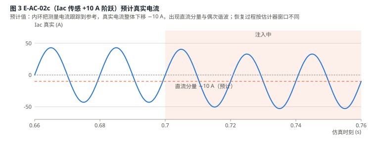

# EV 充电机 PFC 传感链注入测试规划

把《光伏逆变器电磁可靠性测试》中的射频注入项目折算为仿真中的等效测量偏差，在 PV_MEV 模型上对六种 PFC 电流控制策略做统一对比，并定义每项测试应产出的数据表与图。

| 项目 | 内容 |
|---|---|
| 被测模型 | `Simulation/PV_MEV/PV_MEV.slx`（EV System 需按第 3.5 节增加电池充电级） |
| 基线提交 | `548e913`（2026-09-02） |
| 被测策略 | CRPR、MPCC_P、MPCC_D、MPCC_D_F1、MPCC_D_F10、MPCC_D_R |
| 工作点 | Vac 240 V / 50 Hz，Vdc 参考 400 V，电池恒流 20 A / 恒压 350 V（约 6.9 kW） |
| 现有工具 | `init_paras.m`（按 `VARIANT_NAME` 读 `config.csv`）、`run_benchmark.m`、`results/benchmark_results.csv` |
| 图 | `docs/figures/fig1` 到 `fig6`，均为预计示意图，实测后替换 |

值的标注约定：**[实]** 已有基准数据；**[预]** 由外环关系或电路参数解析得出的预期值；**[待]** 只能由仿真给出，表中只写预期方向。

---

## 1 目的与范围

原始测试计划用外部射频场干扰逆变器的电压和 Hall 电流传感链，观察控制环、保护逻辑、母线和并网侧的响应。对功率级和控制器而言，射频作用的最终形式只有一种：控制器读到的内部量 y\* 偏离真实量 y 一个等效偏差 Δy。仿真无法复现天线、频率和距离，但可以精确复现 Δy，并把同一组 Δy 施加到不同的电流控制策略上，比较它们的敏感程度和恢复能力。

本规划只覆盖 EV 充电机，五条传感链：

- PFC 级：母线电压 Vdc、电网电压 Vac、电网电流 Iac（对应原文 T-DC-01、T-DC-02、T-AC-01、T-AC-02、T-MUL-01）。
- 电池充电级：电池电压 Vbat、电池电流 Ibat。电池电流测量出现正向偏差时，充电控制器会降低实际充电电流；电池电压测量出现正向偏差时，控制器可能提前从恒流切换到恒压，从而降低充电功率。这一组测试评估充电机面对电磁环境变化时的功率调节能力，重点记录实际充电功率、CC/CV 状态、占空比、母线电压、功率因数以及偏差消失后的恢复时间。

PV 侧（MPPT）测试不在本规划范围内。

**不在范围内。** 传感器 PCB、运放输入级和屏蔽结构的差异（原文 P2、P3 阶段）不能由仿真区分；这些阶段的输出（fc+、fc- 和 Δy 对功率、距离的映射）在这里退化为一个已知的 Δy 幅值序列。

## 2 射频测试到仿真变量的折算

表 2-1 原文阶段与项目在仿真中的对应

| 原文阶段 / 项目 | 物理含义 | 仿真中的处理 |
|---|---|---|
| P0 台架确认、P1 基线采集 | 射频关闭下的稳态数据 | 电阻负载下已完成（表 4-1）；增加充电级后需重跑 B0' |
| P2 频率响应图谱（fc+、fc-） | 找到能使内部量增大或减小的载波 | 不需要。正偏差和负偏差直接用 Δy 的符号表示 |
| P3 幅值与空间标定 Δy = F(fc, P, d, θ, p) | 射频功率、距离到偏差幅值的映射 | 不需要。Δy 幅值直接作为自变量分档（第 5 节） |
| 5.2 单频恒定偏置 | 恒定 Δy 持续数秒 | 阶跃注入，驻留 0.3 s |
| 5.3 幅度调制包络 | Δy 随低频包络变化 | 三角、斜坡、开关包络由信号发生器直接产生 |
| 5.4 双载波双向调节 | 跨越零点的正弦偏差 | 有符号的 50 Hz 正弦 Δy，可设相位 |
| 5.5 斜坡渐进偏置 | Δy = k·t + s0 | 斜坡限幅注入，k 分档 |
| 5.6 多频叠加 | 多个通道同时受扰 | 多个注入块同时使能 |
| P4 闭环项目、P5 重复与恢复 | 整机闭环响应、10 次重复 | 本规划主体。仿真是确定性的，重复次数取 1；只在加入测量噪声时重复 |

等效偏差的作用关系与原文式 (10)、(11) 一致。PFC 级对所有策略成立，因为电压外环相同；充电级对所有策略成立，因为充电控制器相同：

```
PFC 级    Vdc*  = Vdc + Va               内部量 = 真实量 + 偏差
          Vdc   = Vdc,ref − Va          外环把内部量拉到参考值，真实母线反向偏移
充电级    Ibat  = Icc − ΔI               恒流段：真实电流被压低
          Vbat  = Vcv − ΔV               恒压段：真实电压被压低，I = (Vbat − Voc) / Rint
          P_charge = Ibat · Vbat
```

电流链的偏差不经过外环，而是直接进入 PFC 电流内环。三种内环对 Iac 和 Vac 的使用方式不同，这是各策略表现出差异的根源（表 4-2）。充电级的偏差先改变充电功率，再作为负载功率阶跃作用到 PFC，各策略的差异体现在母线电压过渡过程和部分负载下的电流质量。

## 3 仿真测试台

### 3.1 注入点与真实量、内部量的分离

模型现状已经满足原文 3.3 节"真实量与内部量同时记录"的要求：`EV System/Measurements 1` 直接取电路量，相当于独立探头；`PFC Control` 的三个测量输入相当于控制器内部量。注入块插在两者之间。充电级的两个注入点在新增子系统内按同样方式布置。

表 3-1 注入点

| 通道 | 模型位置（EV System 内） | 受影响的控制环节 | 真实量来源 |
|---|---|---|---|
| Vdc | From16 [Vdc_PFC] → PFC Control 输入 2 | 电压外环（Speed Regulator2）；MPCC_D 前馈占空比 D_ff = 1 − \|Vin\| / Vo 和增益 L / (Vo·Ts) | Measurements 1 输入 Vdc |
| Vac | From18 [Vac] → PFC Control 输入 3 | PLL 相位 θ；\|sin θ\| 参考形状；MPCC_P 半周极性判定 sign(Vin)；MPCC_D 前馈 | Measurements 1 输入 Vac |
| Iac | From19 [Iac] → PFC Control 输入 4 | CRPR 的 \|Iac\|；MPCC 逐拍预测的 i_L；FFT / RLS 谐波估计器输入 | Measurements 1 输入 Iac |
| Vbat | Charger Stage / 电压测量 → CC/CV 控制器 | CC→CV 切换判定；CV 环 | 电池端口电压 |
| Ibat | Charger Stage / 电流测量 → CC/CV 控制器 | CC 环；过流判定 | 电池支路电流 |

### 3.2 干扰发生器

做成 MyLibrary 里的一个掩码块，参数由 `tests.csv` 一行提供，输出 Δy(t)，与被扰信号相加。

表 3-2 干扰发生器参数

| 参数 | 含义 | 取值 |
|---|---|---|
| `channel` | 注入通道 | Vdc / Vac / Iac / Vbat / Ibat |
| `shape` | 包络形状（对应原文 5.2 到 5.6） | step / ramp / sine / tri / pulse / hall |
| `amp` | 偏差幅值，带符号 | V 或 A，见第 5 节档位 |
| `k` | 斜坡速率 | V/s 或 A/s，ramp 时有效 |
| `f`, `phase` | 正弦偏差频率与相位（相对 Vac 过零） | 50 Hz；0° 或 90° |
| `period`, `duty` | 开关或三角包络周期与占空比 | pulse / tri 时有效 |
| `t_on`, `dwell` | 注入起始时刻与驻留时间 | 默认 0.70 s 起、驻留 0.30 s |
| `K_hall` | Hall 传感增益，用于把 0.2 V 直流加 0.5 V 振荡换算为电流 | 默认 20 A/V（假设值，需按实际传感器改） |

### 3.3 保护监视块

原文要求母线高值项目使用独立于控制器读数的硬件断电阈值。仿真里加一个只看真实量的监视块，记录首次越限时刻并可封锁 PWM，阈值作为参数：

| 项目 | 条件 |
|---|---|
| 母线欠压 UV | 真实 Vdc < 300 V，持续 2 ms |
| 母线过压 OV | 真实 Vdc > 450 V，持续 2 ms |
| 电网过流 OC | 真实 \|Iac\| > 65 A（1.5 倍额定峰值 43 A） |
| 电池过压 BOV | 真实 Vbat > 355 V，持续 2 ms |
| 电池过流 BOC | 真实 Ibat > 25 A（1.25 倍 Icc） |
| 动作 | 记录触发时刻与原因；默认只记录不封锁，便于观察完整轨迹；可选封锁 PWM |

### 3.4 稳态快照

每条用例从 0.6 s 的模型工作点（`ModelOperatingPoint`）起跑，省去暖机，单次仿真时长 0.7 s。六种策略各保存一份 CC 段快照（Voc 335 V）；E-BAT-02n 另需一份 CV 段快照（Voc 345 V，充电电流 10 A）。

### 3.5 模型扩展：电池充电级

现有 EV System 的负载是电阻 Ro，没有电池和 CC/CV 控制，需要在 EV System 内新增 `Charger Stage` 子系统替代 Ro 支路。参数为假设值，按实际充电机替换。

表 3-3 充电级参数

| 项目 | 取值 | 说明 |
|---|---|---|
| 拓扑 | 降压 DC-DC，400 V 母线 → 电池 | L 1 mH，C 100 µF，开关频率 100 kHz |
| 电池 | 开路电压 Voc 335 V（CC 段快照）/ 345 V（CV 段快照），内阻 Rint 0.5 Ω | 电压源加电阻；也可用 Simscape Battery 块 |
| 恒流 CC | Icc = 20 A，PI 环，参考斜率 100 A/s | 基线：Vbat = 335 + 0.5 × 20 = 345 V，P = 6.9 kW |
| 恒压 CV | Vcv = 350 V，PI 环 | I = (Vcv − Voc) / Rint |
| 状态切换 | Vbat_meas ≥ Vcv → CV；Vbat_meas ≤ Vcv − 5 V 持续 20 ms → 回 CC | 回 CC 的迟滞只为测试恢复过程设置，实际充电机通常单向 |
| 使能 | 0.30 s 起以 100 A/s 斜坡到 20 A | 替代原来 0.4 s 的电阻负载阶跃 |

增加充电级后 PFC 的负载从电阻变为恒功率型，六种策略的无扰基线必须重跑（批次 B0'），表 4-1 中的电阻负载基线仅作参考。

## 4 被测策略与基线

表 4-1 六种策略的无扰基线（电阻负载 22.22 Ω，[实]，2026-09-02，1 s 仿真，最后 100 ms，`results/benchmark_results.csv`）

| 策略 | 电流内环 | Fc | Vdc (V) | Pdc (kW) | Pac (kW) | 效率 | PF | THD50 | 全频带 THD | 纹波 | 阶跃后最低 Vdc | 调节时间 |
|---|---|---|---|---|---|---|---|---|---|---|---|---|
| CRPR | PR 控制器 + 100 kHz PWM | 100 kHz | 400.0 | 7.203 | 7.330 | 98.27% | 0.9995 | 11.20% | 11.28% | 5.93% | 383.6 V | 59 ms |
| MPCC_P | 逐拍预测直接门控，无 PWM | 100 kHz | 400.0 | 7.203 | 7.329 | 98.28% | 0.9996 | 4.86% | 10.49% | 5.67% | 384.0 V | 60 ms |
| MPCC_D | 占空比预测 + 100 kHz PWM | 20 kHz | 400.0 | 7.203 | 7.329 | 98.28% | 1.0000 | 5.22% | 5.37% | 5.72% | 383.5 V | 61 ms |
| MPCC_D_F1 | MPCC_D + 1 周期 FFT 谐波补偿 | 20 kHz | 400.0 | 7.203 | 7.329 | 98.29% | 1.0000 | 2.65% | 2.96% | 5.58% | 382.9 V | 61 ms |
| MPCC_D_F10 | MPCC_D + 10 周期 FFT 谐波补偿 | 20 kHz | 400.0 | 7.203 | 7.329 | 98.29% | 1.0000 | 2.65% | 2.95% | 5.59% | 383.5 V | 61 ms |
| MPCC_D_R | MPCC_D + RLS 谐波补偿 | 20 kHz | 400.0 | 7.203 | 7.329 | 98.28% | 1.0000 | 2.66% | 2.97% | 5.59% | 384.0 V | 58 ms |

表 4-2 各策略对传感链的依赖，即预期敏感点

| 策略 | Vdc 偏差 | Vac 偏差 | Iac 偏差 | Vbat / Ibat 偏差（经充电功率变化间接作用） |
|---|---|---|---|---|
| CRPR | 仅经外环，真实 Vdc = 400 − Va | 仅经 PLL；过零偏移改变 \|sin θ\| 参考形状 | \|Iac + ΔI\| 与 Iref 比较，两个半周都被推偏 −ΔI；PR 带宽有限，偏差进入 100 Hz 谐振项 | 部分负载下 PR 稳态幅值误差不变，THD 上升最多 |
| MPCC_P | 经外环；预测式中的 V_o 项 | sign(Vin) 决定半周极性，直流偏差把切换点移离真实过零，预计每半周一次电流尖峰 | i_L 被逐拍精确跟踪到 Iref，真实电流带 −ΔI 直流分量；无 PWM，尖峰无载波平滑 | 部分负载下逐拍预测步长相对变大，全频带 THD 上升 |
| MPCC_D | 经外环；D_ff 和 plant_gain 都含 Vo | D_ff = 1 − \|Vin\| / Vo 直接受扰，过零附近占空比误差 ΔV / Vo | 同 MPCC_P 的直流分量；追踪增益 0.35 使响应比 MPCC_P 缓 | 母线过渡过程与 CRPR 接近 |
| MPCC_D_F1 / F10 / R | 同 MPCC_D | 同 MPCC_D | 污染后的 Iac 进入谐波估计器，偏差被当作谐波补偿回参考；窗口决定恢复时间：F1 约 20 ms，F10 约 200 ms，RLS 约 3 × 18 ms | 功率阶跃时估计器需要重新收敛，THD 暂时上升，F10 最慢 |

## 5 自变量与档位

幅值按原文第 7 节公开范围等比例缩放到本模型：原文母线 385 V、本模型 400 V；原文电流偏差 −30 到 +320 A 对应大功率机型，本模型电网额定峰值 43 A、电池恒流 20 A。

表 5-1 偏差档位

| 通道 | 原文范围 | 本模型档位 | 物理含义 |
|---|---|---|---|
| Vdc 正偏（T-DC-01） | +20 V 起，参考点 +100 V | +20、+50、+100 V | 真实母线被压低到 380、350、300 V；300 V 触及 UV 阈值 |
| Vdc 负偏（T-DC-02） | −50、−100、−200 V | −50、−100、−200 V（斜坡） | 真实母线被抬高到 450、500、600 V；450 V 起触及 OV 阈值 |
| 斜坡速率 k | 先小后大 | 200、1000 V/s | 到 −100 V 分别需要 0.5 s 和 0.1 s |
| Vac 直流偏差（T-AC-01） | 报警点 200 V 与 240 V | ±17、±34 V（峰值 340 V 的 5%、10%） | 过零偏移 0.16 ms、0.32 ms，相当于 100 kHz 下 16、32 个控制拍，20 kHz 下 3、6 拍 |
| Vac 50 Hz 正弦偏差 | 双载波正弦 | 17 V，相位 0° 和 90° | 0° 改变幅值感知，90° 改变 PLL 相位 |
| Iac 直流偏差（T-AC-02） | 数安培起 | +2、+5、+10、+20 A | 真实电流预计出现等值反号直流分量 |
| Iac 50 Hz 正弦偏差 | 双载波正弦 | 10、20 A，相位 90° | 与电流参考正交，预计直接降低 PF |
| Hall 模型 | 0.2 V 直流 + 0.5 V 振荡 | K_hall = 20 A/V → 4 A 直流 + 10 A 振荡 | 振荡频率取 100 Hz 和 1 kHz 两档 |
| Ibat 偏差 | 电流链 | +2、+5、+10 A；−5 A | 真实充电电流 18、15、10 A；−5 A 时 25 A 触及 BOC |
| Vbat 偏差 | 电压链 | +5、+10、+20 V；−10 V（CV 段快照） | +5 V 到 CC/CV 边界；+10 V 提前进入 CV，功率减半；+20 V 充电停止；−10 V 使 CV 段回到 CC，真实 Vbat 355 V 触及 BOV |
| 多通道（T-MUL-01） | 逐个叠加 | Vdc +50 V 与 Iac +5 A | 观察外环与内环偏差的耦合 |

## 6 测试矩阵

每条用例对六种策略各跑一次。编号前缀 E 表示 EV 充电机侧；P1 为首轮必跑，P2 为完整矩阵。

表 6-1 用例定义（`tests.csv` 的内容）

| 编号 | 原文项目 | 通道 | 形状 | 幅值 | 其他参数 | 优先级 | 主要观测 |
|---|---|---|---|---|---|---|---|
| E-DC-01a | T-DC-01 | Vdc | step | +20 V | t_on 0.70 s，驻留 0.30 s | P2 | 真实 Vdc、内部 Vdc、Iref、Pdc |
| E-DC-01b | T-DC-01 | Vdc | step | +50 V | 同上 | P1 | 同上 |
| E-DC-01c | T-DC-01 | Vdc | step | +100 V | 同上 | P1 | 同上，UV 触发时刻 |
| E-DC-01r | T-DC-01 | Vdc | ramp | 到 +100 V | k = 200 V/s | P2 | 连续跟随、UV 触发时刻 |
| E-DC-02a | T-DC-02 | Vdc | ramp | 到 −50 V | k = 1000 V/s | P2 | 真实 Vdc 上升速率、OV 触发 |
| E-DC-02b | T-DC-02 | Vdc | ramp | 到 −100 V | k = 1000 V/s | P1 | 同上 |
| E-DC-02c | T-DC-02 | Vdc | ramp | 到 −200 V | k = 1000 V/s | P2 | 同上，OV 触发时刻与是否封锁 |
| E-AC-01a | T-AC-01 | Vac | step | +17 V | 驻留 0.30 s | P1 | PLL 相位、过零电流尖峰、THD |
| E-AC-01b | T-AC-01 | Vac | step | +34 V | 同上 | P2 | 同上，OC 触发 |
| E-AC-01s | T-AC-01 | Vac | sine | 17 V | 50 Hz，相位 90° | P2 | PLL 相位偏移、PF |
| E-AC-02a | T-AC-02 | Iac | step | +2 A | 驻留 0.30 s | P2 | 真实电流直流分量、偶次谐波 |
| E-AC-02b | T-AC-02 | Iac | step | +5 A | 同上 | P1 | 同上 |
| E-AC-02c | T-AC-02 | Iac | step | +10 A | 同上 | P1 | 同上，Vdc 100 Hz 波动 |
| E-AC-02d | T-AC-02 | Iac | step | +20 A | 同上 | P2 | 同上，OC 触发 |
| E-AC-02s | T-AC-02 | Iac | sine | 10 A | 50 Hz，相位 90° | P1 | PF、外环 Iref 变化 |
| E-AC-02h | 2.2 Hall 模型 | Iac | hall | 4 A + 10 A | 振荡 100 Hz / 1 kHz | P2 | THD、谐波估计器输出 |
| E-MUL-01 | T-MUL-01 | Vdc + Iac | step | +50 V，+5 A | 同时注入 | P2 | 与单通道结果的差值 |
| E-BAT-01a | 电池电流链 | Ibat | step | +2 A | 驻留 0.30 s，CC 段快照 | P2 | P_charge、Ibat 真实、Vdc 过渡 |
| E-BAT-01b | 电池电流链 | Ibat | step | +5 A | 同上 | P1 | 同上 |
| E-BAT-01c | 电池电流链 | Ibat | step | +10 A | 同上 | P2 | 同上，部分负载 THD、PF |
| E-BAT-01n | 电池电流链 | Ibat | step | −5 A | 同上 | P2 | 真实 25 A，BOC 触发 |
| E-BAT-02a | 电池电压链 | Vbat | step | +5 V | 同上 | P2 | CC/CV 边界，是否切换 |
| E-BAT-02b | 电池电压链 | Vbat | step | +10 V | 同上 | P1 | 提前进入 CV，P_charge 减半，DC-DC 占空比 |
| E-BAT-02c | 电池电压链 | Vbat | step | +20 V | 同上 | P2 | 充电停止，PFC 空载行为 |
| E-BAT-02n | 电池电压链 | Vbat | step | −10 V | CV 段快照 | P2 | CV 回 CC，真实 Vbat 355 V，BOV |
| E-BAT-03 | 电池电流链 | Ibat | pulse | +5 A | 周期 100 ms，占空比 50% | P2 | 功率往复 6.9 / 5.1 kW 时的 Vdc 波动与 CC 环振荡 |

## 7 单次运行时序与停止条件


表 7-1 时序，对应原文 4.3

| 仿真时刻 | 动作 | 对应原文步骤 |
|---|---|---|
| 0.600 s | 从策略对应的稳态快照起跑，载入 tests.csv 一行与保护阈值 | 载入测试编号与限值 |
| 0.600 到 0.700 s | 前置基线 5 个工频周期，核对真实量与内部量在允许区间 | 射频关闭采集 10 s 前置基线 |
| 0.700 s | 注入开始（step 立即到幅值；ramp 按 k 上升） | 施加测试信号 |
| 0.700 到 1.000 s | 驻留 15 个周期；保护监视块持续判定 | 保持到驻留时间或停止条件 |
| 1.000 s | 注入关闭 | 关闭射频 |
| 1.000 到 1.300 s | 恢复记录 15 个周期 | 继续采集至少 10 s |
| 1.300 s | 结束，写出 `results/emi/<编号>_<策略>.csv` 与摘要行 | 保存原始数据与摘要 |

表 7-2 停止条件，对应原文 4.4

| 类别 | 条件（只看真实量） | 动作 |
|---|---|---|
| 母线电压 | Vdc < 300 V 或 > 450 V 持续 2 ms | 记录触发时刻与类别；可选封锁 PWM 并让母线自然放电 |
| 电网电流 | \|Iac\| > 65 A | 同上 |
| 电池 | Vbat > 355 V 持续 2 ms，或 Ibat > 25 A | 记录；可选封锁 DC-DC |
| 控制状态 | D 饱和在 0 或 1 超过 1 个工频周期；Iref 到达 ±100 A 限幅；CC/CV 状态变化 | 记录，不停止 |
| 测量链 | 仿真求解器报错或 NaN | 该次作废，摘要行标 FAILED |

## 8 评价指标

按原文 9.2 分三个窗口统计：注入前（0.60 到 0.70 s）、注入中稳态（0.85 到 1.00 s，最后 7.5 个周期）、恢复后（1.20 到 1.30 s）。

```
测量误差       e_meas   = y_internal − y_real                    （= 注入的 Δy，用于自检）
母线偏差       ΔVdc     = mean(Vdc_real) − 400 V                  注入中窗口
母线过冲/欠冲  max、min(Vdc_real) − 稳态值                        注入开始后 100 ms 内，以及注入结束后 100 ms 内
电流跟踪误差   e_I,rms  = rms(Iref·|sin θ| − |Iac_real|)          注入中窗口
直流分量       I_dc     = mean(Iac_real)                          注入中窗口，一个整周期数
THD50 / 全频带 THD       Iac_real 以 1 MHz 采样，2 到 50 次 / 到 500 kHz
功率因数       PF       = P / S                                   Measurements 1
充电功率       P_charge = mean(Vbat_real · Ibat_real)             注入中窗口；与基线之比为功率保持率
CC/CV 状态     state(t)，t_switch = 首次状态变化时刻 − 0.700 s
DC-DC 占空比   D_dcdc 均值与范围                                  注入中窗口
保护触发       t_trip   = 首次越限时刻 − 0.700 s                  无触发记 —
恢复时间       t_rec    = Vdc_real 回到 400 V ± 1%、P_charge 回到基线 ± 1% 且 THD50 回到基线 + 0.5 个百分点之后的时刻 − 1.000 s
电流峰值       max |Iac_real|                                     整个注入中窗口
```

## 9 预计产出数据表与图

下面的表既是产出格式，也是验收依据：仿真结果与"预计"列偏离超过 5% 时，先怀疑注入块或快照，再怀疑控制器。图 2 到图 6 为预计示意图，同名的实测图由 `run_injection` 用同样的版式生成并替换。

### 9.1 总记分卡

每种策略一行、每条用例一组列，是最终对比图的直接数据源。下表以 P1 用例为例给出预期内容（`results/emi/scorecard.csv`）。

| 策略 | 基线 THD50 | E-DC-01c ΔVdc | E-DC-01c UV 触发 | E-DC-02b ΔVdc | E-DC-02b OV 触发 | E-AC-01a 电流峰值 | E-AC-02c I_dc | E-AC-02c THD50 | E-AC-02s PF | E-BAT-01b P_charge | E-BAT-02b P_charge | E-BAT-02b Vdc 过冲 | 恢复时间 E-AC-02c |
|---|---|---|---|---|---|---|---|---|---|---|---|---|---|
| CRPR | 11.20% [实] | −100 V [预] | 临界 [预] | +100 V [预] | 触发 [预] | ≈ 基线 [待] | −10 A [预] | 上升 [待] | 0.974 [预] | 5.14 kW [预] | 3.40 kW [预] | 每策略 [待] | 约 60 ms [待] |
| MPCC_P | 4.86% [实] | −100 V [预] | 临界 [预] | +100 V [预] | 触发 [预] | 上升，过零尖峰 [待] | −10 A [预] | 上升 [待] | 0.974 [预] | 5.14 kW [预] | 3.40 kW [预] | 每策略 [待] | 约 60 ms [待] |
| MPCC_D | 5.22% [实] | −100 V [预] | 临界 [预] | +100 V [预] | 触发 [预] | 上升，幅度小于 MPCC_P [待] | −10 A [预] | 上升 [待] | 0.974 [预] | 5.14 kW [预] | 3.40 kW [预] | 每策略 [待] | 约 60 ms [待] |
| MPCC_D_F1 | 2.65% [实] | −100 V [预] | 临界 [预] | +100 V [预] | 触发 [预] | 同 MPCC_D [待] | −10 A [预] | 上升，估计器受污染 [待] | 0.974 [预] | 5.14 kW [预] | 3.40 kW [预] | 每策略 [待] | 约 80 ms [待] |
| MPCC_D_F10 | 2.65% [实] | −100 V [预] | 临界 [预] | +100 V [预] | 触发 [预] | 同 MPCC_D [待] | −10 A [预] | 上升，估计器受污染 [待] | 0.974 [预] | 5.14 kW [预] | 3.40 kW [预] | 每策略 [待] | 约 250 ms，最慢 [待] |
| MPCC_D_R | 2.66% [实] | −100 V [预] | 临界 [预] | +100 V [预] | 触发 [预] | 同 MPCC_D [待] | −10 A [预] | 上升，估计器受污染 [待] | 0.974 [预] | 5.14 kW [预] | 3.40 kW [预] | 每策略 [待] | 约 100 ms [待] |

### 9.2 母线电压传感链：E-DC-01 与 E-DC-02

外环对六种策略相同，稳态值可以直接预计，因此这两组表的作用是验证注入链路，并比较各策略在过渡过程中的差异。


表 9-2 E-DC-01 母线正偏，每种策略一行 × 三档，预计稳态值对所有策略相同

| 用例 | Va | 内部 Vdc | 真实 Vdc | Pdc | Iac 峰值 | Iref | UV 触发 | 欠冲 | 调节时间 | 恢复时间 |
|---|---|---|---|---|---|---|---|---|---|---|
| E-DC-01a | +20 V | 400 V [预] | 380 V [预] | 6.50 kW [预] | 39 A [预] | 比基线低约 4 A [待] | — [预] | 每策略 [待] | 每策略 [待] | 每策略 [待] |
| E-DC-01b | +50 V | 400 V [预] | 350 V [预] | 5.51 kW [预] | 33 A [预] | 比基线低约 10 A [待] | — [预] | 每策略 [待] | 每策略 [待] | 每策略 [待] |
| E-DC-01c | +100 V | 400 V [预] | 300 V [预] | 4.05 kW [预] | 24 A [预] | 比基线低约 19 A [待] | 临界，欠冲决定是否触发 [预] | 每策略 [待] | 每策略 [待] | 每策略 [待] |
| E-DC-01r | 斜坡到 +100 V | 400 V [预] | 300 V（0.5 s 后）[预] | 4.05 kW [预] | 24 A [预] | 连续下降 [待] | 取决于跟随滞后 [待] | 无 [预] | 每策略 [待] | 每策略 [待] |

表 9-2 的 Pdc 按电阻负载 22.22 Ω 计算；换成充电级后，母线偏差期间充电级仍维持 6.9 kW 恒功率（DC-DC 占空比上升补偿），Pdc 列改为 6.9 kW 不变，Iac 峰值改为 43 × 400 / Vdc_real。

表 9-3 E-DC-02 母线负偏（斜坡 1000 V/s）

| 用例 | Va | 真实 Vdc 稳态 | 上升速率 | OV 触发时刻 | OC 触发 | 恢复时间 |
|---|---|---|---|---|---|---|
| E-DC-02a | −50 V | 450 V [预] | 约 1000 V/s，受外环限制 [预] | 临界，约 50 ms [预] | — [预] | 每策略 [待] |
| E-DC-02b | −100 V | 500 V [预] | 同上 | 约 50 ms [预] | — [预] | 每策略 [待] |
| E-DC-02c | −200 V | 600 V，或被 Iref 100 A 限幅截止 [预] | 同上 | 约 50 ms [预] | 临界 [预] | 每策略，外环退饱和时间 [待] |

### 9.3 电网电压传感链：E-AC-01

表 9-4 E-AC-01 Vac 偏差，策略 × 用例

| 策略 | 用例 | 过零偏移 | 电流峰值 | THD50 | 全频带 THD | PF | OC 触发 | Vdc 波动 | 预期机理 |
|---|---|---|---|---|---|---|---|---|---|
| CRPR | E-AC-01a / b | 0.16 / 0.32 ms [预] | ≈ 基线 [待] | 略升 [待] | 略升 [待] | 略降 [待] | — [预] | ≈ 基线 [待] | 只经 PLL，参考形状轻微畸变 |
| MPCC_P | E-AC-01a / b | 0.16 / 0.32 ms [预] | 明显上升 [待] | 上升 [待] | 上升 [待] | 下降 [待] | b 档可能触发 [待] | 出现 100 Hz 分量 [待] | 极性判定用 sign(Vin)，每半周 16 / 32 拍极性错误 |
| MPCC_D 系列 | E-AC-01a / b | 0.16 / 0.32 ms [预] | 上升，小于 MPCC_P [待] | 上升 [待] | 上升 [待] | 略降 [待] | — [预] | 略升 [待] | 过零附近前馈占空比误差 5% / 10%，由 PWM 平滑 |
| 全部 | E-AC-01s | 相位偏移 arctan(17/340) = 2.9° [预] | ≈ 基线 [待] | ≈ 基线 [待] | ≈ 基线 [待] | 0.9987 [预] | — [预] | ≈ 基线 [待] | PLL 跟随偏移后的相位，电流相对电网移相 |

### 9.4 电网电流传感链：E-AC-02



表 9-5 E-AC-02 Iac 直流偏差，策略 × 档位（ΔI = +2 / +5 / +10 / +20 A）

| 策略 | 真实 I_dc | Iref 变化 | THD50 | 2 次谐波 | Vdc 100 Hz 波动 | PF | OC 触发 | 恢复时间 |
|---|---|---|---|---|---|---|---|---|
| CRPR | −2 / −5 / −10 / −20 A [预] | 上升，补偿功率损失 [待] | 随 ΔI 上升 [待] | 出现 [待] | 上升 [待] | 下降 [待] | 20 A 档可能 [待] | 约 60 ms [待] |
| MPCC_P | −2 / −5 / −10 / −20 A [预] | 上升 [待] | 随 ΔI 上升 [待] | 出现 [待] | 上升 [待] | 下降 [待] | 20 A 档可能 [待] | 约 60 ms [待] |
| MPCC_D | −2 / −5 / −10 / −20 A [预] | 上升 [待] | 随 ΔI 上升 [待] | 出现 [待] | 上升 [待] | 下降 [待] | 20 A 档可能 [待] | 约 60 ms [待] |
| MPCC_D_F1 | −2 / −5 / −10 / −20 A [预] | 上升 [待] | 上升，且估计器把直流误判为谐波 [待] | 出现 [待] | 上升 [待] | 下降 [待] | 20 A 档可能 [待] | 约 80 ms [待] |
| MPCC_D_F10 | −2 / −5 / −10 / −20 A [预] | 上升 [待] | 同上，滞后 200 ms [待] | 出现 [待] | 上升 [待] | 下降 [待] | 20 A 档可能 [待] | 约 250 ms [待] |
| MPCC_D_R | −2 / −5 / −10 / −20 A [预] | 上升 [待] | 同上，RLS 有直流项可吸收部分偏差 [待] | 出现 [待] | 上升 [待] | 下降 [待] | 20 A 档可能 [待] | 约 100 ms [待] |


表 9-6 E-AC-02s 与 E-AC-02h：正弦偏差与 Hall 模型

| 用例 | 偏差 | 预计 PF | Iref 稳态 | THD50 | 谐波估计器输出 | 说明 |
|---|---|---|---|---|---|---|
| E-AC-02s，10 A | 10 A · sin(ωt + 90°) | cos(arctan(10/43)) = 0.974 [预] | ≈ 基线（有功不变）[预] | ≈ 基线 [待] | F1 / F10 / R 基波幅值估计偏高 [待] | 真实电流出现与参考正交的分量，无功增加 |
| E-AC-02s，20 A | 20 A · sin(ωt + 90°) | cos(arctan(20/43)) = 0.907 [预] | ≈ 基线 [预] | ≈ 基线 [待] | 同上 [待] | 同上 |
| E-AC-02h，100 Hz | 4 A + 10 A · sin(2π·100t) | 下降 [待] | 上升 [待] | 2 次谐波显著 [待] | 3 次估计受 100 Hz 泄漏影响 [待] | Hall 芯片直接受扰的公开现象 |
| E-AC-02h，1 kHz | 4 A + 10 A · sin(2π·1000t) | 略降 [待] | 上升，20 次谐波 [待] | — | FFT 估计器不受影响，RLS 残差增大 [待] | 测试内环带宽对高频偏差的抑制 |

### 9.5 电池充电级：E-BAT

充电功率的稳态值由充电控制器和电池参数决定，对六种策略相同（图 5）。策略之间的差异出现在功率阶跃时的母线过渡过程和部分负载下的电流质量，因此表 9-8 按策略展开。


表 9-7 E-BAT 稳态预计值（所有策略相同）

| 用例 | 偏差 | 状态 | Ibat 真实 | Vbat 真实 | P_charge | 功率保持率 | 保护 | 说明 |
|---|---|---|---|---|---|---|---|---|
| 基线（CC 段快照） | 0 | CC | 20 A [预] | 345 V [预] | 6.90 kW [预] | 100% | — | Voc 335 V + 0.5 Ω × 20 A |
| E-BAT-01a | Ibat +2 A | CC | 18 A [预] | 344 V [预] | 6.19 kW [预] | 90% | — | 控制器把测量电流压回 20 A |
| E-BAT-01b | Ibat +5 A | CC | 15 A [预] | 342.5 V [预] | 5.14 kW [预] | 74% | — | 同上 |
| E-BAT-01c | Ibat +10 A | CC | 10 A [预] | 340 V [预] | 3.40 kW [预] | 49% | — | 同上 |
| E-BAT-01n | Ibat −5 A | CC | 25 A [预] | 347.5 V [预] | 8.69 kW [预] | 126% | BOC 临界 [预] | 真实电流超额定 |
| E-BAT-02a | Vbat +5 V | CC/CV 边界 | 20 → 抖动 [待] | 345 V [预] | 6.90 kW 附近抖动 [待] | ≈ 100% | — | 测量值恰为 350 V，迟滞决定是否反复切换 |
| E-BAT-02b | Vbat +10 V | CV（提前进入） | 10 A [预] | 340 V [预] | 3.40 kW [预] | 49% | — | I = (350 − 10 − 335) / 0.5 |
| E-BAT-02c | Vbat +20 V | CV，电流为零 | 0 A [预] | 335 V [预] | 0 [预] | 0% | — | 真实 Vbat 目标 330 V 低于 Voc，充电停止，PFC 进入空载 |
| E-BAT-02n（CV 段快照，Voc 345 V） | Vbat −10 V | CV → CC | 10 → 20 A [预] | 350 → 355 V [预] | 3.50 → 7.10 kW [预] | 203% | BOV 临界 [预] | 控制器误认为电压未到 350 V |
| E-BAT-03 | Ibat +5 A 脉冲，100 ms | CC | 20 / 15 A 往复 [预] | 345 / 342.5 V [预] | 6.90 / 5.14 kW 往复 [预] | — | — | 观察 CC 环与母线的周期性响应 |


表 9-8 E-BAT-01b 与 E-BAT-02b 各策略的母线与电网侧响应（功率从 6.9 kW 降到 5.1 / 3.4 kW，再恢复）

| 策略 | 功率下降时 Vdc 过冲 | 功率恢复时 Vdc 欠冲 | 部分负载 THD50（3.4 kW） | 部分负载 PF | DC-DC 占空比（E-BAT-02b） | CC→CV 切换时刻 | 恢复时间 |
|---|---|---|---|---|---|---|---|
| CRPR | 每策略 [待]，预期 +10 到 +20 V | 每策略 [待]，预期 −15 V 量级（基线阶跃 −16 V） | 上升，预期最高 [待] | 略降 [待] | 340/400 = 0.85 [预] | < 1 ms [预] | 约 60 ms [待] |
| MPCC_P | 同上 [待] | 同上 [待] | 全频带 THD 明显上升 [待] | 略降 [待] | 0.85 [预] | < 1 ms [预] | 约 60 ms [待] |
| MPCC_D | 同上 [待] | 同上 [待] | 上升 [待] | 略降 [待] | 0.85 [预] | < 1 ms [预] | 约 60 ms [待] |
| MPCC_D_F1 | 同上 [待] | 同上 [待] | 上升，1 周期后收敛 [待] | 略降 [待] | 0.85 [预] | < 1 ms [预] | 约 80 ms [待] |
| MPCC_D_F10 | 同上 [待] | 同上 [待] | 上升，10 周期后收敛 [待] | 略降 [待] | 0.85 [预] | < 1 ms [预] | 约 250 ms [待] |
| MPCC_D_R | 同上 [待] | 同上 [待] | 上升，约 3 周期后收敛 [待] | 略降 [待] | 0.85 [预] | < 1 ms [预] | 约 100 ms [待] |

### 9.6 多通道：E-MUL-01

表 9-9 E-MUL-01 Vdc +50 V 与 Iac +5 A 同时注入

| 策略 | 真实 Vdc | 真实 I_dc | P_charge | THD50 与单通道之和的差 | 恢复时间 |
|---|---|---|---|---|---|
| 全部 | 350 V [预] | −5 A [预] | 6.90 kW（充电级维持）[预] | 每策略，预期接近 0，非线性耦合体现在偏差处 [待] | 每策略，取两者较大值 [待] |

### 9.7 每次运行的数据文件

表 9-10 `results/emi/<编号>_<策略>.csv` 的列，1 MHz 采样的 Iac 单独存为 `_iac.csv`

| 字段组 | 列 | 说明 |
|---|---|---|
| 标识 | `test_id, variant, commit, snapshot_file, run_time` | 对应原文 9.1 标识组 |
| 注入设置 | `channel, shape, amp, k, f, phase, period, duty, t_on, dwell, K_hall` | tests.csv 原样复制 |
| 工作点 | `Fc, Vref, Icc, Vcv, Voc, Rint, Vac_rms` | 来自 init_paras |
| 时间序列（10 kHz 重采样） | `t, Vdc_real, Vdc_int, Vac_real, Vac_int, Iac_real, Iac_int, Vbat_real, Vbat_int, Ibat_real, Ibat_int, Iref, theta_pll, D, gate, D_dcdc, state, amp_est_3/5/7, Pac, Pdc, P_charge` | 真实量与内部量成对记录 |
| 保护与状态 | `trip_type, t_trip, t_switch, D_sat_flag, Iref_sat_flag` | 对应原文第四组同步数据 |
| 摘要行 | `dVdc, Vdc_over, Vdc_under, e_I_rms, I_dc, THD50_pre/dur/post, THD_full_pre/dur/post, PF_pre/dur/post, P_charge_pre/dur/post, power_retention, I_peak, t_settle, t_rec, status` | 汇总进 scorecard.csv |

### 9.8 图的清单

| 图 | 内容 | 预计版 | 实测版由谁生成 |
|---|---|---|---|
| 图 1 | 单次运行时序与注入包络 | `figures/fig1_timing.svg` | 不变 |
| 图 2 | E-DC-01c 真实 / 内部 Vdc 与 Iref 时序 | `figures/fig2_edc01c.svg` | `run_injection` 每策略一张，叠加六策略的真实 Vdc |
| 图 3 | E-AC-02c 真实电流波形（注入前后） | `figures/fig3_eac02c.svg` | 每策略一张 |
| 图 4 | E-AC-02c 恢复时间横条图 | `figures/fig4_recovery.svg` | 由 scorecard 生成 |
| 图 5 | E-BAT 充电功率随 ΔI、ΔV 的曲线 | `figures/fig5_ebat_curves.svg` | 由表 9-7 实测值生成，六策略应重合 |
| 图 6 | E-BAT-02b Vbat / Ibat / 状态 / P_charge 时序 | `figures/fig6_ebat02b.svg` | 每策略一张，另加六策略 Vdc 叠加图 |

## 10 执行顺序与工作量

表 10-1 批次

| 批次 | 内容 | 运行数 | 单次时长 | 3 进程并行耗时 | 产出 |
|---|---|---|---|---|---|
| B0 电阻负载基线 | 已完成（表 4-1） | 6 | 10 min | 已完成 | benchmark_results.csv |
| B0' 充电级基线 | 加入 Charger Stage 后重跑六策略，保存 CC 段与 CV 段快照 | 12 | 10 min | 约 40 min | 新基线、12 份快照 |
| B1 链路验证 | E-DC-01b、E-AC-02b、E-BAT-01b 各跑 CRPR 一次，核对表 9-2、9-5、9-7 的预计值 | 3 | 7 min | 约 10 min | 注入块与快照确认 |
| B2 P1 用例 | 9 条用例 × 6 策略 | 54 | 7 min | 约 2.1 h | 总记分卡 P1 列，图 2 到图 6 实测版 |
| B3 P2 用例 | 17 条用例 × 6 策略 | 102 | 7 min | 约 4.0 h | 完整记分卡与各详表 |

实现上在现有 `run_benchmark` 框架内增加 `tests.csv` 读取、注入块参数写入、快照加载、三窗口指标计算和图的生成；干扰发生器、保护监视块和充电级进 MyLibrary。总运行时间约 7 小时，按第 3.4 节从快照起跑，且并行数保持 3 个以内。

---

依据《光伏逆变器电磁可靠性测试：实验测试规划、信号构造、施加位置、参数范围与判定方法》折算；电阻负载基线来自 2026-09-02 的 PV_MEV 基准（提交 548e913）。"预计"值为解析预期值，须由仿真核实后替换。Hall 传感增益 20 A/V、充电级参数（Voc、Rint、Icc、Vcv）和五个保护阈值为假设值，需按实际参数替换。
