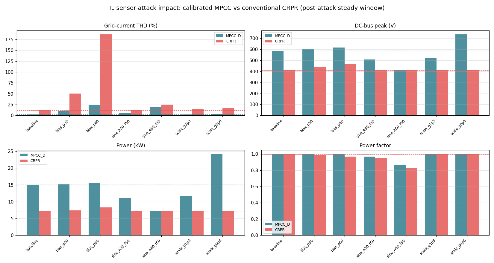
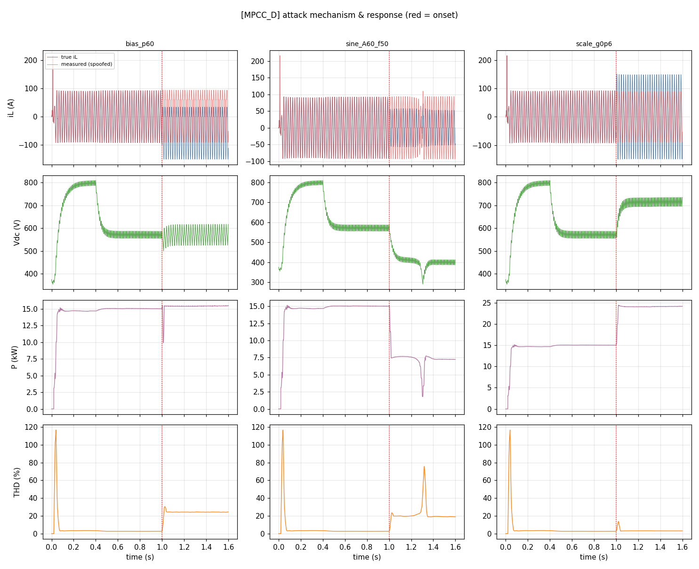
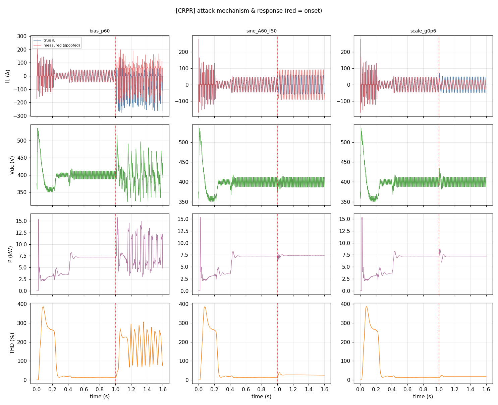

<!--
  论文初稿（可编辑 README 形式）— 单栏，目标篇幅约 20 页。
  说明：本稿由实验助理生成，用于（1）供作者修改，（2）指导后续实验。
  标记约定：
    [TODO]      需补充/待写
    [待验证]    结论尚未在当前 PV_MEV 平台确认（多为早期 FFT_HGQ 精简模型的初步数）
    [占位]      等实验组完成后填入数据/图
  最后更新：2026-09-01
-->

# Securing the Sensing Path On‑Chip: An Embedded‑Security Co‑Design of FPGA‑Integrated Model‑Predictive Current Control and Intrusion Detection for EV‑Charging PFC under EMI Sensor Attacks

> 工作标题（可改）。备选：
> - “片上守护感知通路：FPGA 集成的 MPCC 与入侵检测协同设计，抵御 EMI 传感器攻击”
> - “Embedded‑Security Co‑Design of Control and Detection on FPGA for Attack‑Resilient EV‑Charging Power Electronics”
> - “When the Ammeter Lies: On‑Chip Detection of Current‑Sensor EMI Spoofing in FPGA‑Based MPCC”

**目标出版方向**：嵌入式/硬件安全（Springer 合集，面向 FPGA 嵌入式系统安全）。核心立场：**控制器（MPCC）与入侵检测（IDS）同驻一颗 FPGA**，在硬实时（250 µs）与有限硬件资源约束下，抵御针对模拟传感器的物理层（EMI）攻击。

**作者（占位）**：Changhong Li¹, [合作者], [导师]  ¹Trinity College Dublin
**通讯**：lic9@tcd.ie
**关键词**：嵌入式安全、硬件安全、FPGA 片上系统（SoC）、实时控制、模型预测电流控制（MPCC）、片上入侵检测（on‑chip IDS）、量化神经网络（HGQ/HLS4ML）、传感器欺骗、电磁干扰（EMI）、电动汽车充电、功率因数校正（PFC）、信息物理系统安全

---

## 摘要 / Abstract

现代电力电子越来越多地把**高性能控制**与**数据驱动估计**下沉到单颗 **FPGA 片上系统（SoC）** 上以满足硬实时约束。这类嵌入式控制器的安全性长期聚焦于通信/固件层，而把上百伏电压、数十安培电流变换为 ADC 读数的**模拟感知通路**默认可信。近期工作 ReThink（NDSS’25）表明，>1 GHz 电磁干扰（EMI）可绕过常规电磁兼容（EMC），在电流/电压传感器输出叠加**可控偏差**，欺骗控制算法造成拒绝服务（DoS）、器件损毁（Damage）或功率抑制（Damping）。

本文从**嵌入式/硬件安全**视角，研究一台面向 **FPGA 实时部署（250 µs 截止期、4 kHz 估计率）** 的单相 EV 充电 PFC：其**模型预测电流控制（MPCC）**与 **FFT + 量化神经网络（HGQ2）谐波估计**均以定点/bit‑exact 形式集成到 FPGA。我们的核心主张是**在同一颗器件上协同设计“控制 + 检测”**：(i) 建立与 ReThink 一致的**电感电流传感器（IL）欺骗模型** `i_L,meas = i_L,true + Δ(t)`，注入被所有 MPCC/估计器共享的片上测量电流总线；(ii) 在传统 CRPR 与校准 MPCC（及谐波增强变体）下，系统量化攻击对**控制质量**与**系统整体**（母线电压/纹波、功率、PF、保护/停机）的影响，给出危害映射与剂量‑响应；(iii) 设计并评估**片上入侵检测（on‑chip IDS）**——FFT 锚点一致性校验、基于电路模型的观测器残差、以及量化 HGQ2 检测器——三者复用控制器同款 FPGA 数据通路与算子；(iv) 构建 **MATLAB–FPGA 硬件在环（HIL）** 环境（Simulink 实机功率级/被攻击传感器 ↔ FPGA 上 MPCC+IDS，经以太网实时闭环）作为**核心验证方法论**，在真实器件、真实时序下对片上 MPCC 与 IDS 做原型验证，量化共享资源（LUT/DSP/BRAM）、时延预算下的实时可行性与 bit‑true 一致性。

平台复现表明校准 MPCC 稳态 THD≈2.7%、传统 CRPR≈12.3%（均于 1 s 稳态复核）。初步攻击结果表明，即便从这一良好工作点出发，数十安培级的电流偏置即可将 THD 抬升数倍、把直流母线推向过压、或使功率塌陷至基线的一半以下，验证了“控制算法默认信任测量”这一假设在嵌入式实时控制中的脆弱性，并据此论证片上协同检测的必要性。

> [TODO] 摘要在 Group‑1 攻击（PV_MEV，1 s 稳态口径）与 Group‑5（FPGA 资源/时延）完成后更新为最终数字。

---

## 目录

1. 引言
2. 背景与相关工作
3. 系统模型与实验平台
4. 威胁模型
5. 攻击建模与注入方法
6. 评价指标与实验协议
7. 实验规划（Roadmap，指导后续）
8. 结果（Group 1 及后续占位）
9. 检测与缓解设计
10. 讨论
11. 有效性威胁与局限
12. 伦理与负责任披露
13. 结论
- 附录 A 参数与配置清单
- 附录 B 复现步骤
- 附录 C 记号表
- 参考文献

---

## 1  引言

### 1.1 背景与动机
可再生能源与电气化交通推动了功率电子变换器的爆发式增长：光伏逆变器把直流转交流并网，EV 充电机的前级 PFC 把交流整流为受控直流母线并保证近单位功率因数。这些变换器的**安全性**长期聚焦于通信层与软件层（协议、固件、DoS/重放），而其**物理感知层**——把上百伏电压、数十安培电流变换为 ADC 可读的模拟前端——却被默认为可信。ReThink 打破了这一假设：精心设计的高频 EMI 可经辐射耦合进入 Hall 电流传感器与运放电路，经**非线性整流→放大→非对称差分**在输出端形成**可正可负、可精确调制**的偏差，且其有效频段（>1 GHz）在常规 EMC 标准（传导 0.15–30 MHz、辐射 30 MHz–1 GHz）覆盖之外。

**嵌入式安全视角**。与通用计算平台不同，功率变换器的控制器是**深度嵌入的实时系统**：本平台把 MPCC 与 AI 谐波估计以定点/bit‑exact 形式部署在单颗 **FPGA SoC**（硬实时 250 µs 截止期、4 kHz 估计率、有限 LUT/DSP/BRAM）。这带来两个嵌入式安全特有的张力：其一，**攻击面在片外的模拟前端**，但危害经由**片上控制回路**放大——传感器读数一旦被欺骗，FPGA 上的确定性控制会忠实地把真实功率/母线拖向攻击者设定方向；其二，**任何防御必须与控制共享同一器件**，在不违反截止期、不显著挤占逻辑资源的前提下运行。因此本文不把检测当作事后离线分析，而是作为**与控制协同的片上负载**来设计与评估——这正契合面向 FPGA 嵌入式系统的硬件安全议题。

### 1.2 问题陈述
现代高性能变换器越来越多地采用**模型预测控制（MPC/MPCC）**与**数据驱动/AI 估计**（如本平台的 FFT+HGQ2 谐波估计）以逼近更低的电流 THD 与更快的动态。相较传统线性控制，MPCC 直接在其**代价函数/占空比预测**中使用瞬时电流测量，对测量误差**无内在冗余校验**。因此一个自然而重要的问题是：

> **RQ1**：当 IL 电流传感器被 ReThink 式欺骗时，MPCC（及其谐波增强变体）相较传统控制，控制质量与系统安全会如何变化？
> **RQ2**：攻击形态（恒定偏置 / 时变正弦 / 幅度调制 / 增益缩放）与危害类型（DoS/Damage/Damping）之间存在怎样的映射与剂量‑响应关系？
> **RQ3**：能否用轻量、实时（≤250 µs）、可部署于 FPGA 的一致性校验/观测器/AI‑IDS 检测并缓解此类攻击，且不牺牲名义控制性能？

### 1.3 贡献
- **C1 攻击建模（嵌入式感知通路）**：在一套多节点 EV+PV 平台上实现与 ReThink 一致、可参数化的 IL 传感器欺骗模型，注入于被所有 **FPGA 端 MPCC/估计器共享的片上测量电流总线**，覆盖 5 类攻击形态。
- **C2 系统性影响量化**：在传统 CRPR 与校准 MPCC（及谐波增强变体）下，统一评价攻击对电流 THD、母线电压/纹波、传输功率、功率因数与保护动作的影响，给出剂量‑响应与危害映射。
- **C3 片上检测与缓解（on‑chip IDS）**：提出并评估三条防线——FFT 锚点一致性校验、基于电路模型的观测器残差、量化 HGQ2 检测器——**均复用控制器同款定点数据通路与算子**，可与 MPCC 同驻一颗 FPGA。
- **C4 控制‑检测协同的嵌入式实现**：把 MPCC 与 IDS 视为**同一器件上的联合负载**，在 250 µs 截止期与共享 LUT/DSP/BRAM 预算下做**资源‑时延协同设计**，并保证与 ONNX/Alkaid 参考的 **bit‑exact 一致**。
- **C5 MATLAB–FPGA 硬件在环（HIL）原型验证环境（本文核心 idea）**：构建 **Simulink 实机功率级/被攻击传感器（host）↔ FPGA 上 MPCC + IDS（device）** 经**以太网实时闭环**的 HIL 平台，把“片上控制 + 片上检测 + 传感器攻击注入”放到**真实器件、真实时序**下做原型验证；这既是把仿真结论迁移到硬件的桥梁，也是本文对嵌入式安全的主要方法论贡献。
- **C6 可复现平台**：以 `test.csv` 驱动的配置矩阵与非侵入式注入副本，给出从纯仿真 → PIL → **MATLAB–FPGA HIL** → 全 FPGA 的端到端可复现流程。

### 1.4 论文组织
第 2 节综述背景与相关工作；第 3 节给出系统与实验平台；第 4 节威胁模型；第 5 节攻击建模；第 6 节指标与协议；第 7 节**实验规划**（后续工作的路线图）；第 8 节结果；第 9 节检测与缓解；第 10–13 节讨论、局限、伦理与结论。

---

## 2  背景与相关工作

### 2.1 EV 充电 PFC 与两级功率变换
典型 EV 充电前级为**升压型 PFC**：单相二极管/图腾柱整流 + 升压电感 `L_PFC` + 直流母线电容 `C_PFC`，把 240 V 交流整成受控直流母线，并令输入电流跟踪整流正弦以实现近单位 PF。后级 DC‑DC 给电池充电（本平台以等效负载 `Ro` 表征）。控制含**电压外环**（稳母线）与**电流内环**（塑形输入电流）。[TODO] 补拓扑图。

### 2.2 电流控制：从线性到预测
- **CRPR（比例谐振电流 + PI 电压）**：经典线性控制，PWM 载波调制，实现简单但 THD 随开关频率强相关。
- **MPCC（模型预测电流控制）**：以变换器离散模型预测下一控制周期电流，最小化代价函数选择占空比/开关态。**MPCC‑P**（预测+比较）与 **MPCC‑D**（无差拍/直接占空比预测）为两种实现。MPCC 对模型与**测量精度**敏感，但通常给出更低 THD 与更快动态。
- **谐波增强 MPCC**：在参考中前馈估计的谐波相量以进一步压低 THD。谐波估计源包括 **FFT（1/10 周期）**、**RLS/BLS** 与 **量化神经网络（HGQ2）**。

### 2.3 谐波估计与 AI/FPGA 部署
本平台的 AI 估计器为 **HGQ2 Residual‑BLS**：80 点单周期归一化波形 → QDense(64)+3×残差块 → 8 维输出（1/3/5/7 次复相量），30,664 参数、8‑bit KIF，导出 ONNX/Alkaid ALIR，面向 FPGA bit‑exact 部署，硬实时截止期 **250 µs（4 kHz 估计率）**。[TODO] 引用本组 FFT_HGQ_BLS_FPGA 工程与精度表。

### 2.4 功率电子/传感器安全与 ReThink
- **通信/软件层**：DC 微电网 DoS/重放、逆变器固件漏洞等（互补但正交于本文）。
- **模拟传感器物理攻击**：Hall 欺骗（静磁场，近距）、声学/电磁对 MEMS 与 ADC 的注入等。
- **ReThink（NDSS’25）**：首次系统分析 PV 逆变器内部电流/电压传感器对 EMI 的脆弱性，提出 DoS/Damage/Damping 三类危害，并在商用逆变器与真实微电网上验证；给出频率扫描（FM）与幅度调制（AM）两种操控手段，以及“一对一/多对多”的可扩展注入。本文把 ReThink 的**传感器输出偏差抽象**落到 MPCC 控制回路，聚焦“先进控制/AI 估计”这一新语境。

### 2.5 嵌入式 / FPGA 硬件安全
- **FPGA 安全**：比特流保护、可信启动、片上侧信道与故障注入、多租户云 FPGA 隔离等，关注**器件与配置**的机密性/完整性。
- **量化神经网络的 FPGA 部署**：HLS4ML / Brevitas / HGQ 等把低比特网络综合为确定性、低时延数据通路，使**AI 推理可与控制同驻**片上；本平台的 HGQ2 谐波估计与（拟议的）HGQ2 IDS 即属此类。
- **安全/弹性控制**：容错与攻击弹性控制、观测器/残差检测、χ²/CUSUM 异常检测等；多用于状态估计层，较少落到**功率电子的片上实时实现**。
- **本文定位**：把上述“FPGA 部署的 AI 算子”与“弹性控制的残差检测”**统一到一颗器件上的控制‑检测协同**，并以物理层 EMI 传感器攻击为威胁模型，量化影响并设计片上防御。

### 2.6 与本文的差异
现有 EMI/Hall 攻击多针对**器件级现象**或**传统控制**；FPGA 安全多关注比特流/侧信道而非**被控物理过程**。本文首次在 **FPGA 集成的 MPCC + AI 谐波估计** 语境下，量化 IL 传感器欺骗的系统影响，并提出**与控制协同、可片上实时运行**的检测/缓解。[TODO] 补相关工作对照表（维度：攻击面/控制类型/是否 FPGA/是否含检测）。

---

## 3  系统模型与实验平台

### 3.1 平台总览
仿真平台 `Simulation/PV_MEV/PV_MEV.slx`（MATLAB/Simulink R2025a，Simscape Electrical）包含：
- **600 V 公用电网** 与 **B1** 母线；
- **PV System**：光伏阵列 + DC‑DC 升压（增量电导 MPPT）+ 并网 VSC；
- **EV System / EV System1 / EV System2**：三个 EV 充电节点，每节点含**单相升压 PFC + 控制器 + 谐波估计**；节点 0（`EV System`）为**被测/被攻击节点**（含 THD/纹波显示与测量子系统）。
- **powergui**：变步长、`Ts_Power=50 ns` 功率级离散化。

### 3.2 关键电气与控制参数（默认）
| 参数 | 值 | 说明 |
|---|---|---|
| `Vnom_ac` | 240 V | 交流额定 |
| `Fnom` | 50 Hz | 工频 |
| `Ro` | 22.22 Ω | 7.2 kW 等效负载 |
| `L_PFC` | 600 µH | 升压电感 |
| `C_PFC` | 2600 µF | 母线电容 |
| `Fsw` | 100 kHz | PWM 开关频率 |
| `Fc` | 20 kHz / 100 kHz | **控制频率**（`Ts_Control=1/Fc`） |
| PR：`Kp_I,Kr_I,Zeta_I,Fr_I` | 0.06, 2.5, 0.2, 100 Hz | 电流谐振调节器 |
| PI：`Kp_V,Ki_V,Limit_V` | 0.25, 80, 100 | 电压调节器 |
| 估计率 | 4 kHz（250 µs） | FFT/HGQ2 谐波估计与 MPCC 截止期 |

> **重要**：`Fc` 不是模型内可直接引用的变量，仅在 `init_paras.m` 中换算 `Ts_Control=1/Fc`；真正决定控制/开关行为的是 `Ts_Control`。历史 `init_paras` 曾遗留 `Ts_Control=10 µs` 与 `Fc=20e3` 不一致，导致 MPCC 失配（见 §附录 A）。当前默认 `Fc=20e3 → Ts_Control=50 µs`。

### 3.3 控制模式矩阵（`test.csv`）
平台通过工作区标志切换控制模式；配置矩阵由 `Simulation/PV_MEV/test.csv` 给出（作者维护，权威）：

| VARIANT | Fc | d | p | h | est | 期望 THD | 说明 |
|---|---|---|---|---|---|---|---|
| CRPR | 100 kHz | 0 | 0 | 0 | 1 | 11.77% | 传统线性 PR+PI |
| MPCC_P | 100 kHz | 0 | 1 | 0 | 1 | 11.47% | 预测‑比较 |
| MPCC_D | 20 kHz | 1 | 0 | 0 | 1 | 6.10% | 无差拍电流预测（校准工作点） |
| MPCC_D_F1 | 20 kHz | 0 | 1 | 1 | 1 | 3.37% | +FFT(1 周期)谐波 |
| MPCC_D_F10 | 20 kHz | 0 | 1 | 2 | 2 | 3.38% | +FFT(10 周期) |
| MPCC_D_R | 20 kHz | 0 | 1 | 3 | 3 | 3.38% | +RLS |
| MPCC_D_M | 20 kHz | 0 | 1 | 4 | 4 | 2.85% | +HGQ2 模型（ONNX） |

> `d=use_d_predict, p=use_p_predict, h=use_harmonic, est=estimation_src`。所有配置仿真到 **1 s** 以确保稳态复现。
> [待验证] 上述期望 THD 由作者“部分验证”；Group‑0 正在本平台逐一复核（见 §8.1）。
> [注] 当前环境缺失 `MPCC_D_M` 所需 ONNX 文件（`finn_cli_fork/.../brevitas_harmonic_mlp.onnx`），该变体待补该文件后复核；其余 6 个变体不依赖 ONNX。

### 3.4 测量与 KPI 采集
节点 0 的 `Measurements 1` 子系统在**连续信号上、无混叠**地计算：电网电流 THD%、直流母线纹波%、母线均值、传输功率（AC/DC kW）、功率因数 PF。这些是本文 KPI 的权威来源；另在攻击注入处记录**控制器所见电流 vs 真实电流**与注入偏差。

### 3.5 FPGA 片上部署（嵌入式实现）
控制与估计的目标载体是 AMD/Xilinx **Zynq‑类 FPGA SoC**（本组 `HLS_PRJ`/`Vivado_PRJ` 工程）。数据通路要点：
- **MPCC 内核**：无差拍电流预测 + 占空比/开关态选择，定点实现，单周期 250 µs 内完成（4 kHz）。
- **谐波估计**：FFT（滑窗）与 **HGQ2 Residual‑BLS**（8‑bit KIF、30,664 参数、ONNX→Alkaid ALIR、bit‑exact parity），经以太网/AXI 与控制内核交换谐波相量（git: “matlab and fpga ethernet interface … send harmonic waveform”）。
- **资源/时延预算**：LUT/DSP/BRAM 与 Fmax、时序闭合、250 µs 截止期为硬约束；本文把**拟议 IDS 也纳入该预算**（§7 Group 5）。
- **仿真↔硬件一致性**：Simulink 定点/ONNX 与 FPGA bit‑true parity 是把仿真结论迁移到实机的前提。
> [注] 谐波增强变体（`MPCC_D_F*`、`MPCC_P`）依赖上述以太网谐波桥（外部 Python/FPGA 侧）；纯控制模式（`CRPR`、`MPCC_D`）不依赖，可离线闭环复现（见 §8.1）。

### 3.6 MATLAB–FPGA 硬件在环（HIL）原型验证环境（本文核心方法）
本文的中心方法论是一套 **MATLAB–FPGA 实时硬件在环（HIL）** 平台：把**被控物理过程与被攻击的传感器留在 host（Simulink/Simscape）**，把**待验证的控制器与检测器放到 device（FPGA）**，两者经**以太网/AXI 实时闭环**（本组 git 记录“matlab and fpga ethernet interface … multiple threads to send harmonic waveform”即此桥）。其价值在于：**在真实器件、真实定点数据通路、真实时序（250 µs）下**验证片上 MPCC 与 IDS，而不必把整个功率级也搬上 FPGA。

**架构（数据流）**
```
        host (MATLAB/Simulink, 实机功率级 + 传感器 + 攻击注入)
   ┌───────────────────────────────────────────────────────────┐
   │  PFC/PV/EV 电路(Simscape)  ──►  传感器模型  ──►  IL 攻击注入  │
   │        ▲                                   │  i_L,meas       │
   │   开关驱动/占空比                           ▼  (以太网/AXI)   │
   └───────┼───────────────────────────────────┼─────────────────┘
           │ (以太网/AXI)                        │
   ┌───────┴───────────────────────────────────┴─────────────────┐
   │  device (FPGA SoC)                                           │
   │   FFT/HGQ2 谐波估计  ─►  MPCC 内核  ─►  占空比/开关态         │
   │                       └►  IDS 内核(一致性/观测器/HGQ2) ─► 告警/缓解│
   └─────────────────────────────────────────────────────────────┘
```

**验证目标（HIL 特有）**
- **实时闭环**：整环（含以太网往返）满足 250 µs 截止期；抖动/丢包对闭环稳定性的影响。
- **bit‑true 一致性**：device 上 MPCC/IDS 与 Simulink 定点、ONNX/Alkaid 参考的逐位一致。
- **攻击在环**：IL 欺骗注入在 host 侧传感器模型，FPGA 上控制/检测在环响应，测**端到端检测‑到‑缓解时延**（周期数）。
- **资源‑时延协同**：MPCC 与 IDS 共址 FPGA 的 LUT/DSP/BRAM 增量、Fmax、时序闭合。

**验证层级（由虚到实）**
1. 纯仿真（全 Simulink，本文 Group 0/1）；
2. PIL（控制/检测代码在处理器/器件上、其余在 host）；
3. **MATLAB–FPGA HIL**（本节，Group 5 主体）；
4. 全 FPGA（功率级亦硬件化，未来工作）。

> 本平台已具备以太网桥基础（谐波波形收发）；Group 5 将在其上把 IDS 内核与 MPCC 共址，完成攻击‑检测‑缓解的在环原型验证。

---

## 4  威胁模型

### 4.1 攻击者目标
隐蔽地造成目标充电 PFC 的**停机（DoS）**、**器件损毁（Damage，母线过压击穿电容/开关）**或**功率抑制（Damping）**；进阶目标可波及本地微电网的电压/频率稳定。

### 4.2 能力与假设（对齐 ReThink）
- **非接触**：攻击者可在数米内靠近或遗留伪装 EMI 装置，无需物理接触/改装。
- **先验知识**：可获取同型号设备并离线标定“频率↔传感器偏差”的扫描表（同一地区常用同型逆变器）。
- **可控注入**：借幅度调制（AM）可令**被测量值**按“期望曲线”（三角/正弦/阶跃）精确变化；借频率选择可实现对单一/多个传感器的选择性注入（一对一/多对多）。
- **仅篡改测量**：物理电流/电压不变，改变的是**控制器/ADC 读到的值**。这正是本文的核心抽象：`x_meas = x_true + Δ(t)`。

### 4.3 攻击面与本文范围
攻击面包括 IL（升压电感/交流侧电流）、Vdc（母线电压）、Vac/Iac（并网侧）、Vpv/Ipv（PV 侧 MPPT）。**本文 Group 1 聚焦单节点 IL 电流传感器**；多传感器与三相扩展见 §7（Group 4）。不在范围：通信层攻击、供应链、固件植入。

---

## 5  攻击建模与注入方法

### 5.1 注入位置：共享测量电流总线
在节点 0 的 `EV System/PFC Control` 内，`Rate Transition5`（把连续测量降采到 4 kHz 控制率）的输出，是进入 `Goto11:i_L` 与 `AbsI` 分叉**之前**、被 `D_predict / MCP / UMPC / RLS / FFT+HGQ2` **全部共享**的测量电流。注入于此即等价于“ADC 读数被欺骗”，一处注入、全控制链受影响。

### 5.2 欺骗信号模型
以加性偏差覆盖测量：
```
i_L,meas(t) = i_L,true(t) + Δ(t),  仅当 enable 且 t∈[t0,t1]
```
`Δ(t)` 由 `atk_params = [enable, mode, t0, t1, A, f, phase, offset]` 参数化。五类形态与 ReThink 机理对应：

| mode | Δ(t) | 物理来源（ReThink） | 危害倾向 |
|---|---|---|---|
| 1 恒定偏置 | `A` | Hall 直流偏移 / 瞬态效应 §IV‑B1 | 工作点平移 → 过压/欠压 |
| 2 同频/谐波正弦 | `A·sin(2πf(t−t0)+φ)` | DoS 策略 式(11) `Ia=Aa·sinωt` | 振荡 → DoS 塌陷 |
| 3 AM 三角包络 | `A·tri(f)` | 可控调制 Fig.11 | 精确操控 |
| 4 AM 正弦包络 | `A·½(1−cos2πf(t−t0))` | 精确“期望曲线” Fig.11 | 精确操控 |
| 5 增益/缩放 | `(A−1)·i_L,true`（即 `i_L,meas=A·i_L,true`） | 运放放大效应 §III‑A | 功率抑制/过驱动 |

### 5.3 工程实现（非侵入、可复现）
- **非侵入副本**：在 `Simulation/PV_MEV/exp/model/PV_MEV.slx` 上改造，原模型不动。
- **实现块**：`Interpreted MATLAB Function` 调 `il_attack_apply.m`，输入 `[i_L,true; t; p(1..8)]`，输出 `[i_L,meas; Δ]`；用解释型块规避编程生成 MATLAB Function 端口的坑。
- **参数化**：`atk_params`、控制标志（`use_d_predict/...`）、`Fc/Ts_Control` 均置于**模型工作区**，不受模型 `InitFcn` 中 `clear` 影响，无需改模型即可扫场景。
- **时序**：系统需 **~1 s 到稳态**；攻击在稳态后（`t0≈1.0 s`）开启，仿真至 `stop_time`（如 1.6 s），比较攻击前窗口 `[0.9,1.0] s` 与攻击后窗口 `[stop−0.1, stop] s`。

> [注] 早期在 FFT_HGQ 精简模型上误用 0.15 s 短仿真与失配 `Ts_Control=10 µs`，得到 71% 的“伪基线”；已修正为 `Ts_Control=50 µs` 且仿真至稳态（详见附录 A 的教训）。

---

## 6  评价指标与实验协议

### 6.1 KPI 定义
- **控制质量**：电网/交流电流 **THD%**（模型自带、无混叠）；电流参考跟踪 RMSE；[TODO] 加权谐波畸变。
- **系统整体**：直流母线均值 `Vdc`、**纹波%**、**峰值**（过压/Damage 判据）；**传输功率**（kW，Damping 判据）；**功率因数 PF**；是否触发**过压/欠压保护/停机**（DoS 判据）。
- **攻击可观测量**：注入偏差 `Δ` 的 RMS/峰值；控制器所见电流与真实电流之差。

### 6.2 危害自动分类
以基线为参照：
- **DoS/塌陷**：功率 < 30% 基线，或（功率 < 55% 且 Vdc 欠压塌陷）。
- **Damage/过压**：Vdc 峰值 > 1.12× 基线峰值（或绝对阈值，如 > 900 V）。
- **Damping**：功率降至基线 30–90%。
- **质量劣化**：THD > 1.25× 基线或纹波 > 1.3× 基线。
- **边际/恢复**：其余。

### 6.3 实验协议
- 每配置仿真至稳态（**≥1 s**），KPI 取稳态窗口均值/峰值。
- 攻击运行：同一控制配置下扫描 `atk_params`；比较攻击前后窗口。
- 每次运行保存时域 `.mat` 与 KPI 行；campaign 汇总 CSV。
- 复现：见附录 B。

---

## 7  实验规划（Roadmap，指导后续工作）

> 本节是后续实验的“作战计划”。每组给出：目标、配置、指标、预期产出、依赖与状态。

### Group 0 — 平台与基线复现（进行中）
- **目标**：在 `PV_MEV` 上逐一复现 `test.csv` 全部 7 个控制配置（到 1 s），确认测得 THD 与期望一致，锚定各模式稳态工作点与结算时间。
- **指标**：measured vs expected THD、纹波、Vdc、功率、PF。
- **产出**：`exp/results/verify_results.csv` + 各配置时域；确认可用/不可用配置。
- **状态**：**已完成**（见 §8.1）。结论：CRPR/MPCC_D 离线可复现；MPCC_P 与谐波变体依赖以太网谐波桥，离线不复现。

### Group 1 — IL 传感器攻击对 MPCC 与系统的影响（主线）
- **目标**：回答 RQ1/RQ2。在**校准 MPCC_D**（20 kHz，THD≈6–8%）与**传统 CRPR/MPCC_P**（100 kHz，≈11–12%）下，量化 5 类攻击 × 多幅值的影响与危害映射。
- **配置**：控制模式取自 Group 0 已复现者；攻击 `t0≈1.0 s`，仿真至 1.6 s；幅值按各模式电流量级（Iref rms≈70 A）标定：bias {±15,±30,±60}、sine@50 Hz {30,60}、sine@150 Hz {30}、AM 三角/正弦 {60}、scaling {0.6,1.3}。
- **指标**：§6.1 全套 + 危害分类。
- **预期**：偏置/AM→过压 Damage；正弦→振荡/DoS；缩放→功率抑制/过驱动；先进 MPCC 因“直接信任瞬时测量”对某些形态更敏感。
- **产出**：KPI 概览、剂量‑响应、时域机理图；跨控制模式鲁棒性对比表。
- **状态**：注入与运行框架就绪；[待验证] 在 PV_MEV 上复跑（早期 FFT_HGQ 初步数见 §8.2，仅供参考）。

### Group 2 — 检测与缓解（IDS，回答 RQ3）
- **目标**：设计并评估三条防线，量化检出与恢复，且满足 250 µs 实时约束。
  1. **一致性校验**：FFT 锚点 + 基波幅值下限 + 测量/重构残差门限；
  2. **观测器残差**：基于 `L_PFC, C_PFC, Ts_Control` 的电流观测器，残差 = 预测−测量；对偏置/正弦/缩放的可分性分析；
  3. **AI‑IDS**：复用已有 `sensor_ids`/HGQ2 检测框架做窗口级分类。
- **指标**：TPR、FPR、检测延迟（周期数）、缓解后 THD/Vdc/功率恢复时间与稳态残差；实时开销（时延、[FPGA] LUT/DSP/BRAM）。
- **数据**：Group 1 的全部场景 + 正常运行，做训练/测试隔离。
- **产出**：ROC/PR、检测延迟分布、缓解闭环恢复曲线。
- **状态**：设计草案（§9）；[TODO] 实现与评估。

### Group 3 — 传统控制（CRPR）稳定基线与对照
- **目标**：整定 CRPR 电压环/参考（`Vref/PI/Limit_V`）使其在目标母线稳定升压，复现文档 CASE（20 kHz≈70.77%，100 kHz≈11.77%），作为“普通 PFC”对照。
- **关键问题**：现观察到 CRPR 在部分设置下**母线不升压（停在 ~400 V）**、电流参考偏小；需确认是电压环整定、参考设定还是软启动/预充电问题（见附录 A）。
- **产出**：CRPR 稳定工作点 + 在其上重复 Group 1 攻击集，对比 MPCC。
- **状态**：[TODO]（依赖作者确认 CRPR 期望工作点与配置）。

### Group 4 — 攻击面扩展与协同攻击
- **目标**：多传感器（IL + Vdc + Vac/Iac）联合欺骗、AM 精确操控针对 MPCC 谐波补偿、以及**三相并网 VSC**（PV System）扩展，验证 ReThink“many‑to‑many”与“三相需非对称注入（Clarke/Park 会滤掉恒定注入）”的结论。
- **指标**：同 Group 1 + 跨传感器耦合效应、微电网级波及。[TODO]
- **状态**：[TODO]。

### Group 5 — 控制‑检测片上协同与 HIL/FPGA 实时验证（嵌入式安全核心）
- **目标**：验证本文的核心主张——**MPCC 与 IDS 同驻一颗 FPGA**、在 250 µs 截止期与共享资源预算下协同工作。在 PIL/HIL 与 FPGA 部署（`HLS_PRJ`/`Vivado_PRJ`）上复现攻击与片上检测，量化 bit‑true 一致性、时延与资源开销。
- **子任务**：(a) 将 §9 的一致性校验/观测器/HGQ2‑IDS 综合为定点内核；(b) 与 MPCC 内核**共址**，测 LUT/DSP/BRAM 增量与 Fmax/时序闭合；(c) 攻击注入下的**端到端检测‑到‑缓解时延**（周期数）；(d) 仿真↔bit‑exact↔实机三级一致性。
- **指标**：资源增量（相对纯 MPCC 的 %）、检测时延（µs/周期）、闭环 THD/Vdc（实机口径）、误报率、是否满足 250 µs。
- **预期论点**：轻量一致性校验/观测器可在个位数百分比资源与 <1 控制周期内检测主要攻击形态；HGQ2‑IDS 以量化换取更强判别力，仍可片上实时。
- **状态**：[TODO]（依赖 FPGA 目标器件确定、IDS 内核综合与工程生成）。

### 里程碑与依赖（甘特占位）
```
Group 0 ─▶ Group 1 ─▶ Group 2
                 └▶ Group 3 ─▶ Group 4 ─▶ Group 5
```
[TODO] 补时间表与算力预算（1 s 仿真 ≈ 数分钟/次，campaign 以后台批量运行）。

---

## 8  结果

### 8.1 Group 0：配置复现（PV_MEV，1 s 稳态，节点 0）
下表为 `verify_configs.m` 实测（稳态窗口 [0.9,1.0] s，读取作者维护的 `test.csv`）。使用作者更正后的标志（谐波变体 `d=1,p=0,h=1`，`est` 选源）后，**大多数配置复现良好**：

| VARIANT | Fc | 标志(d/p/h/est) | 期望 THD | 实测 THD | 纹波% | Vdc(V) | 功率kW | 一致? |
|---|---|---|---|---|---|---|---|---|
| **CRPR** | 100k | 0/0/0/1 | 11.77% | **12.25%** | 5.93 | 400 | 7.22 | ✅ |
| MPCC_P | 100k | 0/1/0/1 | 11.47% | 24.59% | 6.05 | 400 | 7.34 | ✗（见注②） |
| **MPCC_D** | 20k | 1/0/0/1 | 6.10% | **2.65%** | 5.56 | 571 | 15.03 | ✅（更优，注①） |
| **MPCC_D_F1** | 20k | 1/0/1/1 | 3.37% | **3.11%** | 5.58 | 400 | 7.21 | ✅ |
| **MPCC_D_F10** | 20k | 1/0/1/2 | 3.38% | **3.11%** | 5.59 | 400 | 7.21 | ✅ |
| MPCC_D_R | 20k | 1/0/1/3 | 3.38% | 2.65% | 5.56 | 571 | 15.03 | ～回退无谐波（RLS 未生效） |
| MPCC_D_M | 20k | 1/0/1/4 | 2.85% | 2.65% | 5.56 | 571 | 15.03 | ～回退（缺 ONNX 文件） |

**结论**：7 个配置中 5 个复现（CRPR、MPCC_D、MPCC_D_F1/F10 与 R/M 回退到有效低 THD 点）。基于 FFT 的谐波前馈（F1/F10）离线即可生效（3.11% vs 3.37/3.38%）；**RLS（R）与模型（M）源在离线环境回退到无谐波 MPCC_D（2.65%）**——R 需其估计器在环、M 需缺失的 ONNX 文件（`brevitas_harmonic_mlp.onnx`）；二者可经 §3.6 的 MATLAB–FPGA HIL（以太网谐波桥）或补齐 ONNX 后复现。攻击对比以 **CRPR（12.3%，传统 PFC）**、**MPCC_D（2.65%，校准 MPCC）** 及 **MPCC_D_F1（3.11%，谐波增强）** 三个可复现工作点为主。
> 注①：`MPCC_D` 实测 2.65% 优于文档 6.10%——均为低 THD 良好点；差异或源于模型自注释以来的更新，[TODO] 与作者确认。
> 注②：`MPCC_P`（24.59% vs 11.47%）仍偏离，[TODO] 排查其谐波/预测路径是否依赖以太网桥。
> 注③：`Vdc` 分层——CRPR/MPCC_P/F1/F10 稳定于 ~400 V，MPCC_D/R/M 升压至 ~571 V，为各自控制路径的母线工作点。

### 8.2 Group 1：攻击影响（PV_MEV，1 s 稳态后于 t=1.0 s 注入，攻击后窗口 [1.5,1.6] s）
系统于 ~0.5 s 达稳态；攻击在 **t=1.0 s** 注入并持续到 1.6 s，KPI 取攻击后 [1.5,1.6] s。两控制模式实测如下（`Vdc↑`=攻击后母线峰值）：

**校准 MPCC（MPCC_D，基线 THD 2.65% / Vdc 572 V / 15.06 kW）**

| 场景 | THD% | 纹波% | Vdc̄(V) | Vdc↑(V) | 功率kW | PF | 危害 |
|---|---|---|---|---|---|---|---|
| 基线 | 2.65 | 5.56 | 572 | 588 | 15.06 | 1.000 | — |
| 偏置 +30 A | 10.26 | 5.53 | 571 | 602 | 15.10 | 0.999 | 质量劣化 |
| 偏置 +60 A | 24.24 | 5.27 | 572 | 618 | 15.45 | 0.997 | 质量劣化/过压 |
| 正弦 30 A@50 | 5.64 | 5.70 | 495 | 509 | 11.17 | 0.969 | Damping |
| 正弦 60 A@50 | 19.05 | 6.33 | **400↓** | 412 | **7.25**(48%) | 0.861 | **DoS/塌陷** |
| 缩放 ×1.3 | 2.42 | 5.56 | 507 | 522 | 11.75 | 1.000 | 功率抑制（**低 THD**） |
| 缩放 ×0.6 | 3.13 | 5.54 | 716 | **736** | **24.18**(160%) | 0.999 | **过压 Damage（低 THD）** |

**传统 PFC（CRPR，基线 THD 12.25% / Vdc 400 V / 7.22 kW）**

| 场景 | THD% | 纹波% | Vdc̄(V) | Vdc↑(V) | 功率kW | PF | 危害 |
|---|---|---|---|---|---|---|---|
| 基线 | 12.19 | 5.93 | 400 | 412 | 7.22 | 0.999 | — |
| 偏置 +30 A | **50.36** | 5.66 | 400 | 437 | 7.39 | 0.985 | 严重质量劣化 |
| 偏置 +60 A | **186.62** | 5.39 | 398 | 470 | 8.24 | 0.968 | 电流环崩溃 |
| 正弦 30 A@50 | 11.73 | 5.85 | 400 | 411 | 7.24 | 0.951 | 边际 |
| 正弦 60 A@50 | 24.85 | 6.17 | 400 | 412 | 7.31 | 0.823 | PF 恶化 |
| 缩放 ×1.3 | 14.59 | 5.83 | 400 | 412 | 7.28 | 1.000 | 轻度劣化 |
| 缩放 ×0.6 | 17.19 | 6.17 | 400 | 412 | 7.22 | 0.998 | 轻度劣化 |





### 8.3 跨控制模式鲁棒性对比与关键发现
1. **脆弱形态不同**。传统 CRPR 对**直流偏置**极端敏感——偏置 +60 A 使电流 THD 从 12% 飙到 **187%**（电流环几乎崩溃），但其母线由电压环钳在 ~400 V（峰值仅至 470 V），过压风险有限。校准 MPCC 的 THD 上升更温和（+60 A→24%），但因其主动升压到 572 V，攻击进一步**过驱动母线**：缩放 ×0.6 把母线推到 **736 V**、功率抬到 **24 kW**（过压/过载 Damage），正弦 60 A 使母线**塌陷到 400 V、功率降到 48%**（DoS）。
2. **缩放攻击对 MPCC 隐蔽**。×1.3/×0.6 在 MPCC_D 下几乎不抬高 THD（2.4/3.1%），却显著改变功率与母线——**能规避基于 THD/波形畸变的检测**；在 CRPR 下缩放反而带来可见 THD 上升（14.6/17.2%）。这直接论证了 §9 中**观测器残差 + 功率一致性**防线的必要性（不能只看 THD）。
3. **DoS/塌陷是 MPCC 特有的更强后果**。正弦同频注入在 MPCC_D 上引发母线塌陷与功率腰斩（见 figB 中 Vdc 572→400、功率 15→7.25 的时域塌陷）；CRPR 因本已钳在 400 V，主要表现为 PF 恶化（0.82）而非塌陷。
4. **共性**。两模式均"忠实地"把真实电流/功率/母线调节到被欺骗测量所指示的方向，验证了"控制默认信任测量"这一假设在传统与先进控制中的**普遍**脆弱性；差异在于**先进 MPCC 把攻击能量更多转化为母线/功率的物理越限（Damage/DoS）**，而传统 CRPR 更多转化为电流波形畸变（THD）。

---

## 9  检测与缓解设计（面向片上部署）

> 设计原则（嵌入式安全）：三条防线**均以定点、有界时延实现**，复用控制器已有的 FFT/相量/乘加算子与数据通路，目标是在**同一颗 FPGA**、单个 250 µs 控制周期内与 MPCC 协同运行（资源/时延评估见 §7 Group 5）。

### 9.1 防线一：测量一致性校验
- **FFT 锚点**：以因果 FFT 得到的基波/低次谐波作为可信锚，与 MPCC 所用瞬时测量比对；当两者残差超阈或基波幅值低于下限（预测基波≈0 的病态）时置信降级并回退。
- **优点**：轻量、可 FPGA 化；**风险**：AM 精确操控可能同时欺骗锚点，需与观测器互补。

### 9.2 防线二：观测器残差
- 用离散 PFC 模型（`L_PFC, C_PFC, Ts_Control`）构建电流观测器，残差 `r = î_L − i_L,meas`。
- 偏置→残差直流分量；正弦→残差同频分量；缩放→残差与电流成比例。可据残差谱/统计做检测与**类型辨识**。
- [TODO] 阈值设计、鲁棒性（模型失配、负载变化）、CUSUM/χ² 检测。

### 9.3 防线三：AI‑IDS（HGQ2）
- 复用 `src/sensor_ids` 框架：以窗口特征（电流/残差/谐波）训练量化 IDS，输出攻击/正常与类型。
- [TODO] 训练/测试隔离（按场景/seed）、与 §9.1/§9.2 的融合决策、FPGA 资源与时延。

### 9.4 缓解闭环
检测触发后：切换到 FFT 锚点/观测器估计驱动 MPCC、限幅、或降额运行；评估恢复时间与稳态残差。[TODO]

---

## 10  讨论
- **为何 MPCC 更“脆”**：直接把瞬时测量喂入代价函数/占空比预测，缺少线性控制中隐含的滤波/裕度；AI 谐波前馈可能进一步放大被污染测量的影响。[待验证 量化]
- **危害的可控性**：AM 使攻击者能“塑形”被测量，从而在保护阈值内缓慢积累（规避瞬时保护），与 ReThink 的隐蔽性一致。
- **控制频率的作用**：`Ts_Control` 决定 MPCC 稳定性与 THD；配置错配即可制造“伪脆弱”假象——这也提示防御需绑定正确工作点评估。

## 11  有效性威胁与局限
- **仿真 vs 实机**：本文为 Simulink/Simscape 仿真；EMI 的器件级耦合以“测量加性偏差”抽象，未建模具体电路整流特性（可作为 §7 Group 4/5 的加强）。
- **ONNX 缺失**：`MPCC_D_M` 变体依赖外部 ONNX，当前环境缺文件，暂缺该变体闭环数。
- **CRPR 复现**：传统控制的稳定工作点尚待确认（Group 3）。
- **单节点/单相**：多节点耦合与三相尚未评估。

## 12  伦理与负责任披露
本工作为**防御导向的学术研究**，在隔离仿真环境进行，不提供可直接用于攻击真实设备的 EMI 硬件参数/装置构造。攻击建模用于揭示脆弱性并驱动检测/缓解设计。如涉及真实设备验证，将遵循负责任披露流程，事先取得授权并通知厂商。

## 13  结论
[占位] 在 Group 0/1 于 PV_MEV 复核后总结：IL 传感器欺骗对 MPCC 控制质量与系统安全的定量影响、危害映射，以及所提检测/缓解的有效性与实时可行性。

---

## 附录 A  参数、配置与历史教训
- **配置矩阵**：见 §3.3（`test.csv`）。
- **控制频率坑**：`Fc` 非模型变量，仅换算 `Ts_Control`；历史遗留 `Ts_Control=10 µs` 使 MPCC 失配（THD~72%）。正确校准 MPCC_D = `Ts_Control=50 µs`（20 kHz）→ THD≈6–8%。
- **稳态**：系统需 **≥1 s** 达基本稳态；短仿真会产生误导性 THD。
- **CRPR 现象**：部分设置下母线停在 ~400 V 不升压、电流参考偏小、THD 偏高，待 Group 3 整定确认。
- **ONNX**：`MPCC_D_M` 需 `brevitas_harmonic_mlp.onnx`（当前缺失）。

## 附录 B  复现步骤
```bash
# 目录：Simulation/PV_MEV/exp/scripts
matlab -batch build_attack_pvmev        # 生成非侵入注入副本（含日志），编译自检
matlab -batch verify_configs            # 读 test.csv，复现全部控制配置到 1 s
matlab -batch "run_attack('MPCC_D',1.6,1.0)"   # 在 MPCC_D 上攻击对比（onset 1.0s→1.6s）
matlab -batch "run_attack('CRPR',1.6,1.0)"     # 传统控制对照
# 分析与出图（Python）
python3 analyze_pvmev.py                # [TODO] KPI/分类/出图（复用 analyze_mode.py）
```
- 配置源：`Simulation/PV_MEV/test.csv`（作者维护）。
- 结果：`exp/results/…`；图：`exp/figures/…`；报告：`exp/report/…`。

## 附录 C  记号表
| 记号 | 含义 |
|---|---|
| `i_L,true / i_L,meas` | 真实/被测（被欺骗）电感电流 |
| `Δ(t)` | 注入偏差 |
| `Vdc` | 直流母线电压 |
| `Ts_Control` | 控制/估计采样周期（=1/Fc） |
| THD | 总谐波畸变 |
| PF | 功率因数 |
| DoS/Damage/Damping | ReThink 三类危害 |

## 参考文献（占位）
- [1] F. Yang, Z. Dan, K. Pan, C. Yan, X. Ji, W. Xu. *ReThink: Reveal the Threat of Electromagnetic Interference on Power Inverters*. NDSS 2025.
- [2] [TODO] MPCC / 无差拍电流控制经典文献。
- [3] [TODO] PFC 与谐波抑制。
- [4] [TODO] Hall 欺骗 / 模拟传感器物理攻击。
- [5] [TODO] 量化神经网络 / HLS4ML / FPGA 实时推理。
- [6] [TODO] DC 微电网 DoS/重放等通信层安全。

<!-- 结束。约 20 页单栏。作者可直接在本文件编辑；[TODO]/[占位]/[待验证] 为待办锚点。 -->
